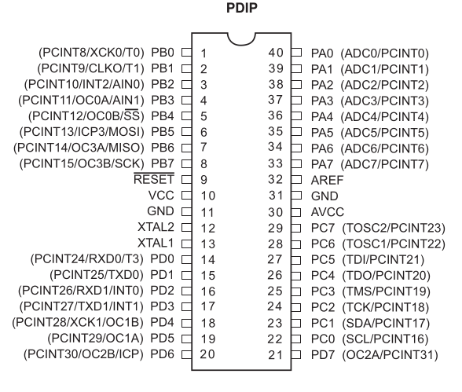

# Projects based on ATmega1284p

.

## Set up development environment

On ubuntu install AVR toolchain

```bash
apt install avrdude gcc-avr gcc-doc avr-libc
```

To develop with [vscode](https://code.visualstudio.com/) add [PlatformIO](https://platformio.org
) vsix [extension](https://marketplace.visualstudio.com/items?itemName=platformio.platformio-ide).

## MCU configuration

### FUSE settings

To calculate fuse mask go to <https://www.engbedded.com/fusecalc/>

To read current fuse settings

```bash
avrdude -c usbtiny -p m1284p -U lfuse:r:-:h -U hfuse:r:-:h
```

To write fuse
Following command sets the clock to 8MHz internal (slow startup 64ms)

```bash
avrdude -c usbtiny -p m1284p -U lfuse:w:0xe2:m -U hfuse:w:0x99:m
```

### Read/Write memory

Read EEPROM and dump on stdout (-) in intel hex format

```bash
avrdude -c usbtiny -p m1284p -U eeprom:r:-:i 
```

Write firmware.hex to flash with [AVR pocket programmer](https://www.sparkfun.com/products/9825)

```bash
avrdude -c usbtiny -p m1284p -U flash:w:firmware.hex:i 
```
