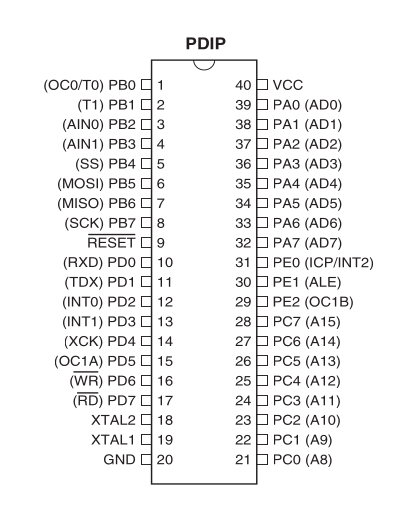

# Projects based on ATmega8515

***The ATmega8515 provides the following features: 8K bytes of In-System Programmable
Flash with Read-While-Write capabilities, 512 bytes EEPROM, 512 bytes SRAM, an
External memory interface, 35 general purpose I/O lines, 32 general purpose working
registers, two flexible Timer/Counters with compare modes, Internal and External inter-
rupts, a Serial Programmable USART, a programmable Watchdog Timer with internal
Oscillator, a SPI serial port, and three software selectable power saving modes. The Idle
mode stops the CPU while allowing the SRAM, Timer/Counters, SPI port, and Interrupt
system to continue functioning. The Power-down mode saves the Register contents but
freezes the Oscillator, disabling all other chip functions until the next interrupt or hard-
ware reset. In Standby mode, the crystal/resonator Oscillator is running while the rest of
the device is sleeping.***

.

## Set up development environment

On ubuntu install AVR toolchain

```bash
apt install avrdude gcc-avr gcc-doc avr-libc
```

To develop with [vscode](https://code.visualstudio.com/) add [PlatformIO](https://platformio.org
) vsix [extension](https://marketplace.visualstudio.com/items?itemName=platformio.platformio-ide).

## MCU configuration

### FUSE settings

To calculate fuse mask go to https://www.engbedded.com/fusecalc/

To read current fuse settings

```bash
avrdude -c usbtiny -p m8515 -U lfuse:r:-:i -U hfuse:r:-:i
```

To write fuse
Following command sets the clock to 8MHz internal (slow startup 64ms)

```bash
avrdude -c usbtiny -p m8515 -U lfuse:w:0xe4:m -U hfuse:w:0xd9:m
```

### Read/Write memory

Read EEPROM and dump on stdout (-) in intel hex format

```bash
avrdude -c usbtiny -p m8515 -U eeprom:r:-:i 
```

Write firmware.hex to flash with [AVR pocket programmer](https://www.sparkfun.com/products/9825)

```bash
avrdude -c usbtiny -p m8515 -U flash:w:firmware.hex:i 
```
