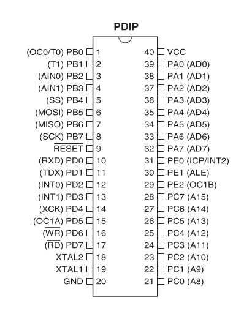

# ATmega8515 Microcontroller Projects

The ATmega8515 is a compact AVR microcontroller with 8KB Flash and 512B SRAM, featuring an external memory interface and USART for serial communication.
Ideal for applications requiring external memory expansion and serial interfacing.

## 📊 Specifications

| Feature              | Value                                           |
|----------------------|-------------------------------------------------|
| **Flash Memory**     | 8 KB                                            |
| **SRAM**             | 512 B                                           |
| **EEPROM**           | 512 B                                           |
| **Pins (DIP)**       | 40                                              |
| **Max Clock**        | 16 MHz                                          |
| **External Memory**  | Up to 64KB                                      |
| **Timers**           | 2 (16-bit)                                      |
| **PWM Channels**     | 2                                               |
| **ADC Channels**     | 8 (10-bit)                                      |
| **I/O Lines**        | 35 general purpose                              |
| **Special Features** | External memory interface, USART, SPI, Watchdog |



**📄 [Full Datasheet](./ATmega8515-datasheet.pdf)**

---

## 🚀 Quick Start

### Installation (Ubuntu/Debian)

```bash
sudo apt install avrdude gcc-avr gcc-doc avr-libc
```

### IDE Setup

Install [Visual Studio Code](https://code.visualstudio.com/) with [PlatformIO IDE](https://marketplace.visualstudio.com/items?itemName=platformio.platformio-ide) extension.

---

## 📂 Projects in This Folder

| Project                         | Description           |
|---------------------------------|-----------------------|
| [**ATmegaHello**](ATmegaHello/) | Basic starter project |
| [**Bot1**](Bot1/)               | Robotics platform     |

---

## 🔧 Configuration & Programming

### Fuse Settings

Use [Engbedded Fuse Calculator](https://www.engbedled.com/fusecalc/) to calculate fuse values.

**Read current fuse settings:**

```bash
avrdude -c usbtiny -p m8515 -U lfuse:r:-:i -U hfuse:r:-:i
```

**Set to 8MHz internal clock (64ms startup):**

```bash
avrdude -c usbtiny -p m8515 -U lfuse:w:0xe4:m -U hfuse:w:0xd9:m
```

### Memory Operations

**Read EEPROM:**

```bash
avrdude -c usbtiny -p m8515 -U eeprom:r:eeprom.hex:i
```

**Write firmware to flash:**

```bash
avrdude -c usbtiny -p m8515 -U flash:w:firmware.hex:i
```

**Chip erase before flashing:**

```bash
avrdude -c usbtiny -p m8515 -e -U flash:w:firmware.hex:i
```

---

## 📦 Building & Uploading

### With PlatformIO

```bash
cd <project-name>      # e.g., cd ATmegaHello
pio run                # Build
pio run -t upload      # Upload to board
pio device monitor     # View serial output
```

---

## 💾 Memory Characteristics

- **Flash:** 8 KB - 10,000 write/erase cycles guaranteed
- **SRAM:** 512 B - plus up to 64KB external memory support
- **EEPROM:** 512 B - 100,000 write/erase cycles
- **External Memory:** Up to 64KB accessible via address/data bus

**Tip:** Use external memory for large data buffers or program storage.

---

## 🛠️ Development Tips

- **Operating frequency:** 16 MHz at 5V
- **Power modes:** Idle, Power-down, and Standby modes
- **Serial:** Full USART with baud rates up to 2Mbps
- **SPI:** Serial Programmable Interface for fast peripheral communication
- **Watchdog Timer:** Built-in with selectable timeout

---

## 📚 Common Libraries

See [../common/readme.md](../common/readme.md) for library documentation:

- **SPI** - High-speed serial communication
- **I2C** - Two-wire interface (bit-banged on GPIO)
- **NRF24L01** - Wireless modules
- **USART** - Serial communication utilities

---

## 🔗 Resources

- [PlatformIO Documentation](https://docs.platformio.org/)
- [AVRDude Manual](https://www.nongnu.org/avrdude/)
