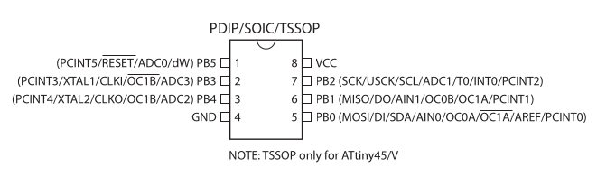

# Projects based on ATtiny45

Features (from datasheet)

- High Performance, Low Power AVR® 8-Bit Microcontroller
- Advanced RISC Architecture
  - 120 Powerful Instructions – Most Single Clock Cycle Execution
  - 32 x 8 General Purpose Working Registers
  - Fully Static Operation
- Non-volatile Program and Data Memories
  - 4K Bytes of In-System Programmable Program Memory Flash
    - Endurance: 10,000 Write/Erase Cycles
  - 256 Bytes In-System Programmable EEPROM
    - Endurance: 100,000 Write/Erase Cycles
  - 256 Bytes Internal SRAM
  - Programming Lock for Self-Programming Flash Program and EEPROM Data Security
- Peripheral Features
  - 8-bit Timer/Counter with Prescaler and Two PWM Channels
  - 8-bit High Speed Timer/Counter with Separate Prescaler
    - 2 High Frequency PWM Outputs with Separate Output Compare Registers
    - Programmable Dead Time Generator
  - USI – Universal Serial Interface with Start Condition Detector
  - 10-bit ADC
    - 4 Single Ended Channels
    - 2 Differential ADC Channel Pairs with Programmable Gain   (1x, 20x)
    - Temperature Measurement
  - Programmable Watchdog Timer with Separate On-chip Oscillator
  - On-chip Analog Comparator
- Special Microcontroller Features
  - debugWIRE On-chip Debug System
  - In-System Programmable via SPI Port
  - External and Internal Interrupt Sources
  - Low Power Idle, ADC Noise Reduction, and Power-down Modes
  - Enhanced Power-on Reset Circuit
  - Programmable Brown-out Detection Circuit
  - Internal Calibrated Oscillator
- I/O and Packages
  - Six Programmable I/O Lines
  - 8-pin PDIP

.

## Set up development environment

On ubuntu install AVR toolchain

```bash
apt install avrdude gcc-avr gcc-doc avr-libc
```

Make sure to be in dialout group to be able to use different USB serial interface.

```bash
sudo usermod -aG dialout <username>
```

To develop with [vscode](https://code.visualstudio.com/) add [PlatformIO](https://platformio.org
) vsix [extension](https://marketplace.visualstudio.com/items?itemName=platformio.platformio-ide).

## MCU configuration

### FUSE settings

To calculate fuse mask go to https://www.engbedded.com/fusecalc/

To read current fuse settings

```bash
avrdude -c usbtiny -p t45 -U lfuse:r:-:h -U hfuse:r:-:h -U efuse:r:-:h
```

To write fuse
Following command sets the clock to 8MHz internal (slow startup 64ms) without divider.
Default factory settings divide by 8, so the clock is 1MHz.
Classical arduino lib assume attiny45 F_CPU is 8MHz.

```bash
avrdude -c usbtiny -p t45 -U lfuse:w:0xE2:m -U hfuse:w:0xDF:m -U efuse:w:0xff:m
```

### Read/Write memory

Read EEPROM and dump on stdout (-) in intel hex format

```bash
avrdude -c usbtiny -p t45 -U eeprom:r:-:i 
```

Write firmware.hex to flash with [AVR pocket programmer](https://www.sparkfun.com/products/9825)

```bash
avrdude -c usbtiny -p t45 -U flash:w:firmware.hex:i 
```
