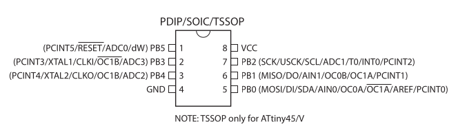

# ATtiny45 Microcontroller Projects

The ATtiny45 is an ultra-compact 8-pin AVR microcontroller with 4KB Flash and 256B SRAM.
It features the USI (Universal Serial Interface) for I2C and SPI communication, making it perfect for minimal-footprint applications.

## 📊 Specifications

| Feature             | Value                            |
|---------------------|----------------------------------|
| **Flash Memory**    | 4 KB                             |
| **SRAM**            | 256 B                            |
| **EEPROM**          | 256 B                            |
| **Pins (PDIP)**     | 8                                |
| **Max Clock**       | 20 MHz                           |
| **Timers**          | 2 (8-bit & 8-bit)                |
| **PWM Channels**    | 2                                |
| **ADC Channels**    | 4 (10-bit) + 2 differential      |
| **Special Feature** | USI (Universal Serial Interface) |



**📄 [Full Datasheet](./ATtiny45-datasheet.pdf)**

---

## 🚀 Quick Start

### Installation (Ubuntu/Debian)

```bash
sudo apt install avrdude gcc-avr gcc-doc avr-libc
```

### IDE Setup

Install [Visual Studio Code](https://code.visualstudio.com/) with [PlatformIO IDE](https://marketplace.visualstudio.com/items?itemName=platformio.platformio-ide) extension.

---

## 📂 Projects in This Folder

| Project                               | Description                 | Size       |
|---------------------------------------|-----------------------------|------------|
| [**BlinkTiny**](BlinkTiny/)           | Basic LED blink             | ~200 bytes |
| [**TinyDigit**](TinyDigit/)           | Single digit display driver | ~1 KB      |
| [**SPI**](SPI/)                       | SPI communication demo      | ~800 bytes |
| [**WeatherStation**](WeatherStation/) | Sensor data logger          | ~2 KB      |

---

## 🔧 Configuration & Programming

### Fuse Settings

Use [Engbedded Fuse Calculator](https://www.engbedded.com/fusecalc/) to calculate fuse values.

**Read current fuse settings:**

```bash
avrdude -c usbtiny -p t45 -U lfuse:r:-:h -U hfuse:r:-:h
```

**Set to 8MHz internal clock (64ms startup):**

```bash
avrdude -c usbtiny -p t45 -U lfuse:w:0xe2:m -U hfuse:w:0x99:m
```

### Memory Operations

**Read EEPROM:**

```bash
avrdude -c usbtiny -p t45 -U eeprom:r:eeprom.hex:i
```

**Write firmware to flash:**

```bash
avrdude -c usbtiny -p t45 -U flash:w:firmware.hex:i
```

**Chip erase before flashing:**

```bash
avrdude -c usbtiny -p t45 -e -U flash:w:firmware.hex:i
```

---

## 📦 Building & Uploading

### With PlatformIO

```bash
cd <project-name>      # e.g., cd BlinkTiny
pio run                # Build
pio run -t upload      # Upload to board
pio device monitor     # View serial output (if UART present)
```

---

## 🔌 Pin Layout

| Pin | Function    | Alt Function   |
|-----|-------------|----------------|
| 1   | PB5 / Reset | (or GPIO)      |
| 2   | PB3 / I/O   | ADC3           |
| 3   | PB4 / I/O   | ADC2           |
| 4   | GND         | -              |
| 5   | PB0 / I/O   | MOSI/SDA (USI) |
| 6   | PB1 / I/O   | MISO/SCK (USI) |
| 7   | PB2 / I/O   | ADC1           |
| 8   | VCC         | -              |

### Special Features

- **USI:** Enables SPI and I2C communication on PB0/PB1
- **ADC:** 4 single-ended + 2 differential pairs with programmable gain (1x, 20x)
- **Analog Comparator:** AIN0/AIN1
- **Oscillator:** Internal or external (1-20 MHz)

---

## 💾 Extreme Memory Constraints

- **Total Flash:** 4 KB - Plan every byte!
- **SRAM:** 256 B - Stack + data must fit
- **EEPROM:** 256 B - Persistent storage
- **Typical stack depth:** ~50-100B after variables
- **Flash cycles:** 10,000 write/erase guaranteed
- **EEPROM cycles:** 100,000 write/erase guaranteed

**Critical Tips:**

- Use compiler optimizations: `-Os -mcall-prologues`
- Put constants in flash: `const PROGMEM`
- Avoid recursion
- Minimize variable sizes (use `uint8_t` not `int`)
- String literals are expensive - use sparse notation
- Consider assembly for tight loops

---

## 🛠️ Development Tips

- **Clock:** Default 1MHz (factory divider by 8). Change fuse for 8MHz.
- **Power:** Ultra-low-power suitable for battery applications (< 100µA)
- **PWM:** 2 channels via Timer0 and Timer1
- **No UART:** Serial communication via USI bit-bang only
- **Temperature:** On-chip temperature sensor available

### Code Size Examples

```c
// Typical sizes on ATtiny45:
void loop() { ... }        // ~100 bytes
digitalWrite(pin, state)   // ~30 bytes
Serial-like functions      // UNAVAILABLE (no UART)
I2C driver                 // ~300-400 bytes
SPI driver                 // ~200-300 bytes
```

---

## 📚 Common Libraries

See [../common/readme.md](../common/readme.md) for library documentation:

- **TinySPI** - SPI via USI (very tight space)
- **I2C** - Two-wire interface via bit-bang or USI
- **AVRTools** - Essential utilities and macros

**Note:** Most complex libraries won't fit. Select minimal implementations.

---

## ⚠️ Common Pitfalls

**Program size exceeded?** The ATtiny45 is extremely size-constrained. Use:

- `-Os` compiler optimization
- Remove unnecessary features
- Write in assembly for critical sections

**Program behaves erratically?** Likely stack corruption from insufficient SRAM. Reduce variable sizes or move to ATtiny84.

**Clock too slow?** Factory default 1MHz due to divider by 8. Set lfuse to 0xE2 for 8MHz.

---

## 🔗 Resources

- [Microchip ATtiny45 Datasheet](./ATtiny45.pdf)
- [AVR Instruction Set](https://ww1.microchip.com/downloads/en/DeviceDoc/Atmel-0856-AVR-Instruction-Set-Manual.pdf)
- [PlatformIO Documentation](https://docs.platformio.org/)
- [AVRDude Manual](https://www.nongnu.org/avrdude/)
- [Engbedded Fuse Calculator](https://www.engbedded.com/fusecalc/)

Make sure to be in dialout group to be able to use different USB serial interface.

```bash
sudo usermod -aG dialout <username>
```

To develop with [vscode](https://code.visualstudio.com/) add [PlatformIO](https://platformio.org
) vsix [extension](https://marketplace.visualstudio.com/items?itemName=platformio.platformio-ide).

## MCU configuration

### FUSE settings

To calculate fuse mask go to <https://www.engbedded.com/fusecalc/>

To read current fuse settings

```bash
avrdude -c usbtiny -p t45 -U lfuse:r:-:h -U hfuse:r:-:h -U efuse:r:-:h
```

To write fuse
Following command sets the clock to 8MHz internal (slow startup 64ms) without divider.
Default factory settings divide by 8, so the clock is 1MHz.
Classical arduino lib assume attiny45 F_CPU is 8MHz.

```bash
avrdude -c usbtiny -p t45 -U lfuse:w:0xE2:m -U hfuse:w:0xDF:m -U efuse:w:0xff:m
```

### Read/Write memory

Read EEPROM and dump on stdout (-) in intel hex format

```bash
avrdude -c usbtiny -p t45 -U eeprom:r:-:i 
```

Write firmware.hex to flash with [AVR pocket programmer](https://www.sparkfun.com/products/9825)

```bash
avrdude -c usbtiny -p t45 -U flash:w:firmware.hex:i 
```
