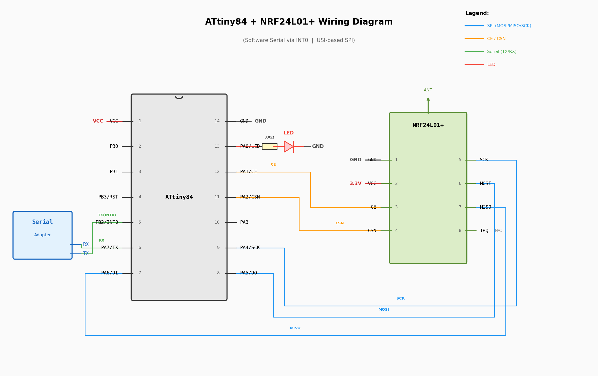

# ATtiny84 + NRF24L01+ I2C/SPI Project

An ATtiny84-based project that communicates wirelessly via an NRF24L01+ radio module using USI-based SPI, with software serial (INT0) for debugging and command input.

## Features

- **NRF24L01+ radio** communication over SPI (USI)
- **Software serial** via INT0 interrupt (TX on PA7, RX on PB2)
- **LED** heartbeat blink on PA0
- Optional **Nunchuk** support over I2C (disabled by default)

## Wiring Diagram



### Pin Assignments

| ATtiny84 Pin | Port | Function         | Connected To         |
|--------------|------|------------------|----------------------|
| Pin 1        | VCC  | Power            | 3.3V / 5V supply     |
| Pin 2        | PB0  | I2C SCL (soft)   | nunchuk SCL          |
| Pin 3        | PB1  | I2C SDA (soft)   | nunchuk SDA          |
| Pin 4        | PB3  | RESET            | Serial Adapter TX    |
| Pin 5        | PB2  | INT0 / Serial RX | Serial Adapter TX    |
| Pin 6        | PA7  | Serial TX        | Serial Adapter RX    |
| Pin 7        | PA6  | USI DI (MISO)    | NRF24L01+ MISO (7)   |
| Pin 8        | PA5  | USI DO (MOSI)    | NRF24L01+ MOSI (6)   |
| Pin 9        | PA4  | USI SCK          | NRF24L01+ SCK (5)    |
| Pin 10       | PA3  |                  |                      |
| Pin 11       | PA2  | CSN              | NRF24L01+ CSN (4)    |
| Pin 12       | PA1  | CE               | NRF24L01+ CE (3)     |
| Pin 13       | PA0  | LED              | LED (via 330Ω to GND)|
| Pin 14       | GND  | Ground           | GND                  |

> **Note:** The NRF24L01+ must be powered at **3.3V**. If the ATtiny84 runs at 5V, use a voltage regulator for the radio module.

## Build

This project uses [PlatformIO](https://platformio.org/). No Arduino framework is used — it builds directly against `avr-libc`.

```bash
# Build
pio run

# Upload (via serial on /dev/ttyS0)
pio run -t upload
```

## Libraries

| Library    | Purpose                              |
|------------|--------------------------------------|
| `avrtools` | GPIO macros, INT0 software serial    |
| `tinyspi`  | USI-based SPI master/slave driver    |
| `nrf24l01` | NRF24L01+ radio manager              |
| `i2c`      | I2C master (for Nunchuk)             |
| `nunchuk`  | Wii Nunchuk driver over I2C          |

## Usage

Once flashed, the ATtiny84 will:

1. Blink the LED on PA0 every 500ms
2. Listen for serial commands on PB2 (INT0) at the configured baud rate
3. Forward received commands to the NRF24L01+ radio for wireless transmission
