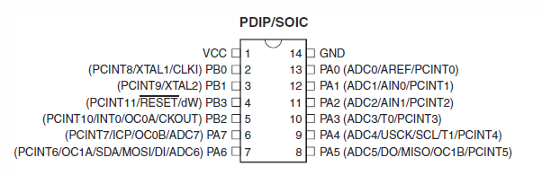

# ATtiny84 Microcontroller Projects

The ATtiny84 is a versatile 14-pin AVR microcontroller with 8KB Flash and 512B SRAM.
Its USI (Universal Serial Interface) enables I2C and SPI communication while maintaining a minimal footprint, making it ideal for resource-constrained applications.

## 📊 Specifications

| Feature             | Value                            |
|---------------------|----------------------------------|
| **Flash Memory**    | 8 KB                             |
| **SRAM**            | 512 B                            |
| **EEPROM**          | 512 B                            |
| **Pins (PDIP)**     | 14                               |
| **Max Clock**       | 20 MHz                           |
| **Timers**          | 2 (8-bit & 16-bit)               |
| **PWM Channels**    | 4                                |
| **ADC Channels**    | 8 (10-bit)                       |
| **Special Feature** | USI (Universal Serial Interface) |
| **Interrupts**      | Pin change on 12 pins            |



**📄 [Full Datasheet](./ATtiny84-datasheet.pdf)**

---

## 🚀 Quick Start

### Installation (Ubuntu/Debian)

```bash
sudo apt install avrdude gcc-avr gcc-doc avr-libc
```

### Permissions Setup

Add yourself to the `dialout` group for USB serial access:

```bash
sudo usermod -aG dialout $USER
# Log out and log back in for changes to take effect
```

### IDE Setup

Install [Visual Studio Code](https://code.visualstudio.com/) with [PlatformIO IDE](https://marketplace.visualstudio.com/items?itemName=platformio.platformio-ide) extension.

---

## 📂 Projects in This Folder

| Project                     | Description             | Features                  |
|-----------------------------|-------------------------|---------------------------|
| [**BlinkTiny**](BlinkTiny/) | Basic LED blink         | GPIO, timers              |
| [**I2C**](I2C/)             | Two-wire interface demo | I2C communication via USI |
| [**NRF24**](NRF24/)         | Wireless communication  | 2.4GHz module via SPI     |

---

## 🔧 Configuration & Programming

### Fuse Settings

Use [Engbedded Fuse Calculator](https://www.engbedded.com/fusecalc/) to calculate fuse values.

**Read current fuse settings:**

```bash
avrdude -c usbtiny -p t84 -U lfuse:r:-:h -U hfuse:r:-:h -U efuse:r:-:h
```

**Set to 8MHz internal clock (64ms startup, no divider):**

```bash
avrdude -c usbtiny -p t84 -U lfuse:w:0xE2:m -U hfuse:w:0xDF:m -U efuse:w:0xff:m
```

**Note:** Factory default divides clock by 8 (1MHz). Most Arduino libraries assume 8MHz.

### Memory Operations

**Read EEPROM:**

```bash
avrdude -c usbtiny -p t84 -U eeprom:r:eeprom.hex:i
```

**Write firmware to flash:**

```bash
avrdude -c usbtiny -p t84 -U flash:w:firmware.hex:i
```

**Read flash memory:**

```bash
avrdude -c usbtiny -p t84 -U flash:r:flash.hex:i
```

**Chip erase before flashing:**

```bash
avrdude -c usbtiny -p t84 -e -U flash:w:firmware.hex:i
```

---

## 📦 Building & Uploading

### With PlatformIO

```bash
cd <project-name>      # e.g., cd I2C
pio run                # Build
pio run -t upload      # Upload to board
pio device monitor     # View serial output
```

---

## 🔌 Pin Layout & Special Features

Key pin functions:

- **PORTA** (7 pins): ADC0-ADC7, GPIO
- **PORTB** (3 pins): RESET, XTAL1, XTAL2
- **SPI Pins:** PB0 (MOSI), PB1 (MISO/SCK - shared via USI)
- **I2C Pins:** PA6 (SCL), PA7 (SDA) - USI bit-bang mode
- **Analog Comparator:** PA0/PA1

### Universal Serial Interface (USI)

The USI enables:

- **I2C Master Mode** - Two-wire communication
- **SPI Master/Slave** - Synchronous serial (TinySPI library)
- **UART Emulation** - Software serial communication

See [../common/tinyspi/](../common/tinyspi/) and [../common/i2c/](../common/i2c/) for library usage.

---

## 💾 Memory Constraints

- **Total Flash:** 8 KB for code
- **SRAM:** 512 B - Very tight! Plan carefully
- **EEPROM:** 512 B - Persistent storage
- **Stack:** Lives in SRAM - risk of corruption with large variables
- **Flash cycles:** 10,000 write/erase guaranteed
- **EEPROM cycles:** 100,000 write/erase guaranteed

**Tips:**

- Use `const` and `PROGMEM` for constant data
- Minimize local variables in deeply nested functions
- Consider external EEPROM for data logging
- Avoid recursive functions

---

## 🛠️ Development Tips

- **Clock:** Default 1MHz (divide by 8). Most projects need 8MHz (change fuse)
- **Power consumption:** Can operate down to 1.8V for low-power applications
- **Low-power modes:** Idle, ADC Noise Reduction, Standby, Power-down
- **Temperature sensor:** On-chip ADC channel for temperature measurement
- **Debugging:** debugWIRE on-chip debug system available

---

## 📚 Common Libraries

See [../common/README.md](../common/readme.md) for library documentation:

- **TinySPI** - SPI via USI for ATtiny (displays, wireless)
- **I2C** - Two-wire interface via USI (sensors, displays)
- **NRF24L01** - 2.4GHz wireless modules
- **AVRTools** - Low-level utilities and macros

---

## ⚠️ Common Issues

**Clock too slow?** Factory default is 1MHz (divider by 8). Set fuse to E2 for 8MHz.

**Memory full?** 8KB goes quickly. Use compiler optimizations: `-Os -mcall-prologues`

**USI conflicts?** Can't use both I2C and SPI simultaneously - plan your pin usage.

---

## 🔗 Resources

- [PlatformIO Documentation](https://docs.platformio.org/)
- [AVRDude Manual](https://www.nongnu.org/avrdude/)
- [Engbedded Fuse Calculator](https://www.engbedded.com/fusecalc/)
