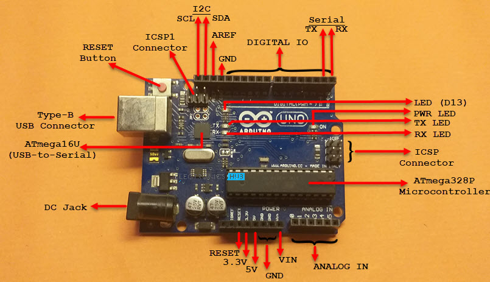
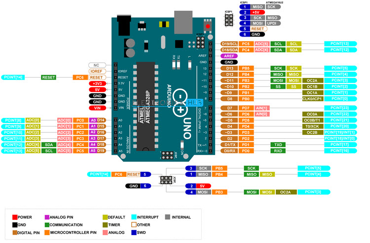
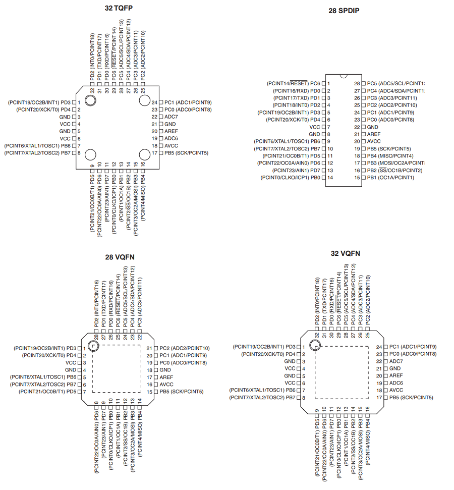

# Arduino UNO Projects

The Arduino UNO is an open-source microcontroller board based on the ATmega328P. It provides a beginner-friendly platform with extensive community support, built-in USB programming, and the Arduino ecosystem.

## 📊 Specifications

| Feature               | Value                        |
|-----------------------|------------------------------|
| **Microcontroller**   | ATmega328P                   |
| **Flash Memory**      | 32 KB                        |
| **SRAM**              | 2 KB                         |
| **EEPROM**            | 1 KB                         |
| **Digital I/O Pins**  | 14 (6 PWM)                   |
| **Analog Input Pins** | 6 (10-bit ADC)               |
| **Operating Voltage** | 5V                           |
| **Clock Speed**       | 16 MHz                       |
| **USB Connector**     | Type B (programming & power) |

### Board Layouts





---

## 🚀 Quick Start

### Installation

**Ubuntu/Debian:**

```bash
sudo apt install arduino arduino-cli avrdude
```

**macOS (Homebrew):**

```bash
brew install arduino-cli
```

**Windows:**
Download from [arduino.cc](https://www.arduino.cc/en/software)

### IDE Options

1. **[Arduino IDE](https://www.arduino.cc/en/software)** - Official Arduino development environment
2. **[PlatformIO](https://platformio.org/)** - Advanced IDE with VS Code integration
3. **[Arduino CLI](https://arduino.github.io/arduino-cli/)** - Command-line tool for headless builds

### First Upload

```bash
# Connect UNO via USB, then:
cd Bluetooth    # Or any project directory
arduino-cli compile -b arduino:avr:uno --upload -p /dev/ttyACM0 .
```

---

## 📂 Featured Projects

| Project                     | Description                 | Components             |
|-----------------------------|-----------------------------|------------------------|
| [**Bluetooth**](Bluetooth/) | Bluetooth wireless control  | HC-05 module, serial   |
| [**Tank**](Tank/)           | Mobile robot platform       | Motors, sensors        |
| [**OLED**](OLED/)           | Display interface           | SSD1306 OLED, I2C      |
| [**NRF24L01**](NRF24L01/)   | 2.4GHz wireless             | NRF24L01+ module, SPI  |
| [**Servo**](servo/)         | Servo motor control         | Servo motor, PWM       |
| [**Sound**](Sound/)         | Audio output                | Speaker/buzzer         |
| [**LED**](LED/)             | LED control demos           | LEDs, GPIO             |
| [**I2C**](I2C/)             | Two-wire interface          | I2C sensors/displays   |
| [**SPI**](SPI/)             | Serial peripheral interface | SPI devices            |

---

## 🔌 Pin Reference

### Digital Pins (0-13)

| Pin | Function   | Special Features          |
|-----|------------|---------------------------|
| 0   | RX         | Serial input              |
| 1   | TX         | Serial output             |
| 2   | INT0       | External interrupt 0      |
| 3*  | PWM        | Timer2B                   |
| 4   | GPIO       | -                         |
| 5*  | PWM        | Timer0B                   |
| 6*  | PWM        | Timer0A                   |
| 7   | GPIO       | -                         |
| 8   | GPIO       | -                         |
| 9*  | PWM        | Timer1A                   |
| 10* | PWM + SS   | Timer1B, SPI Slave Select |
| 11* | PWM + MOSI | Timer2A, SPI MOSI         |
| 12  | MISO       | SPI Master In Slave Out   |
| 13  | SCK        | SPI Clock, LED indicator  |

**\* = PWM capable**

### Analog Pins (A0-A5)

| Pin | ADC      | Notes                |
|-----|----------|----------------------|
| A0  | ADC0     | Analog input 0       |
| A1  | ADC1     | Analog input 1       |
| A2  | ADC2     | Analog input 2       |
| A3  | ADC3     | Analog input 3       |
| A4  | ADC4/SDA | I2C data (also ADC)  |
| A5  | ADC5/SCL | I2C clock (also ADC) |

### Power & Ground

- **5V** - Main power output (from USB or external supply)
- **3.3V** - Low-power supply (if available)
- **GND** - Ground (multiple pins)

---

## 🔧 Programming & Configuration

### Arduino Bootloader

The UNO comes pre-loaded with the Arduino bootloader, enabling USB programming without an ISP programmer.

**Reset bootloader (if corrupted):**

```bash
avrdude -c arduino -p m328p -P /dev/ttyACM0 -b 115200 -U flash:w:optiboot.hex:i
```

### Fuse Settings

For advanced low-level control, read/write fuses directly:

```bash
# Read current fuses
avrdude -c usbtiny -p m328p -U lfuse:r:-:h -U hfuse:r:-:h -U efuse:r:-:h

# Set for 16MHz external crystal
avrdude -c usbtiny -p m328p -U lfuse:w:0xff:m -U hfuse:w:0xde:m -U efuse:w:0x05:m
```

---

## 📦 Building & Uploading

### With Arduino IDE

1. Select **Tools > Board > Arduino AVR Boards > Arduino UNO**
2. Select **Tools > Port > /dev/ttyACM0** (or your port)
3. Click **Upload** (Ctrl+U)

### With Arduino CLI

```bash
# List available boards
arduino-cli board list

# Compile
arduino-cli compile -b arduino:avr:uno .

# Upload
arduino-cli upload -b arduino:avr:uno -p /dev/ttyACM0 .
```

### With PlatformIO

```bash
# Build
pio run -e uno

# Upload
pio run -e uno -t upload

# Monitor serial
pio device monitor
```

### Serial Monitoring

```bash
# Arduino CLI
arduino-cli monitor -p /dev/ttyACM0

# minicom
minicom -D /dev/ttyACM0 -b 9600

# screen
screen /dev/ttyACM0 9600
```

---

## 📚 Available Libraries

### Communication Protocols

- **Serial** - Built-in UART via USB (9600-115200 baud)
- **I2C (Wire)** - Pins A4 (SDA), A5 (SCL) - Built-in library
- **SPI** - Pins 10-13 - Built-in library
- **[NRF24L01](NRF24L01/)** - 2.4GHz wireless modules
- **[Bluetooth](Bluetooth/)** - HC-05/HC-06 serial modules

### Display & Output

- **[OLED](OLED/)** - SSD1306 displays via I2C/SPI
- **[Servo](servo/)** - PWM servo motor control
- **[LED](LED/)** - GPIO LED control
- **[Sound](Sound/)** - Buzzer/speaker audio output

### Sensors & Input

- **Temperature** - DS18B20, DHT22, BME280
- **Distance** - HC-SR04 ultrasonic
- **Motion** - PIR sensor, accelerometer
- **Buttons** - Digital input with debouncing

---

## ⚡ Power Management

### Power Sources

1. **USB Power** - ~500mA available
2. **External 5V** - Via power jack (7-12V DC recommended)
3. **Barrel Jack** - 5.5mm outer, 2.1mm inner (center positive)

### Power Consumption

| State        | Current |
|--------------|---------|
| Idle (16MHz) | ~40 mA  |
| Sleep mode   | ~100 µA |
| Power-down   | ~10 µA  |

### Low-Power Operation

```cpp
#include <avr/sleep.h>

void sleep() {
  set_sleep_mode(SLEEP_MODE_PWR_DOWN);
  sleep_enable();
  sleep_cpu();
  sleep_disable();
}
```

---

## 🛠️ Troubleshooting

### Board Not Recognized

- Check USB cable (data, not charge-only)
- Install CH340 drivers if using clones
- Try different USB port

### Upload Fails

- Verify COM port selection
- Check baud rate (bootloader uses 115200)
- Hold reset during upload if needed

### Code Won't Compile

- Include correct headers: `#include <Arduino.h>`
- Check for typos in pin definitions
- Verify selected board matches hardware

### Program Resets Unexpectedly

- Check for stack overflow (large arrays)
- Verify power supply voltage is stable
- Check watchdog timer settings

---

## 📖 Learning Resources

- [Arduino Official Tutorials](https://www.arduino.cc/en/Tutorial)
- [Arduino UNO Pinout Guide](https://www.arduino.cc/en/Hacking/PinMapping328P)
- [ATmega328P Datasheet](https://ww1.microchip.com/downloads/en/DeviceDoc/Atmel-7810-COMPID-328P-DS-DS40001984B.pdf)
- [Arduino IDE Documentation](https://docs.arduino.cc/software/ide-v2/)

---

## 🔗 Community Resources

- [Arduino Official Website](https://www.arduino.cc/)
- [Arduino Forum](https://forum.arduino.cc/)
- [Stack Overflow - Arduino](https://stackoverflow.com/questions/tagged/arduino)
- [Arduino Reference](https://www.arduino.cc/reference/en/)
