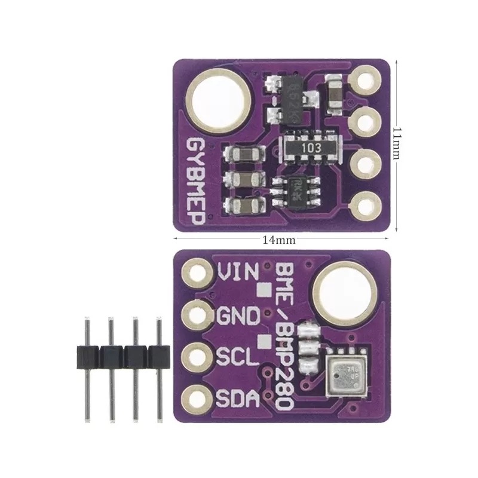

# BME280 Environmental Sensor Driver

A comprehensive C/C++ driver for the Bosch BME280 and BMP280 environmental sensors, providing temperature, pressure, and humidity (BME280 only) measurements via I2C communication.



## Features

- **Multi-parameter sensing**: Temperature, pressure, and humidity (BME280) or temperature and pressure only (BMP280)
- **High accuracy**: Bosch factory calibration with compensation algorithms
- **Configurable oversampling**: Adjustable measurement resolution for all parameters
- **Low power operation**: Selectable operating modes (Sleep, Forced, Normal)
- **IIR filtering**: Built-in digital filter for noise reduction
- **I2C interface**: Simple 2-wire communication
- **Microcontroller optimized**: Integer-only arithmetic for efficiency

## Table of Contents

- [Hardware Overview](#hardware-overview)
- [Installation](#installation)
- [API Reference](#api-reference)
- [Data Formats](#data-formats)
- [Usage Examples](#usage-examples)
- [Configuration](#configuration)
- [References](#references)

## Hardware Overview

| Feature     | BME280 | BMP280 |
|-------------|--------|--------|
| Temperature | ✓      | ✓      |
| Pressure    | ✓      | ✓      |
| Humidity    | ✓      |        |
| I2C Address | 0x76   | 0x76   |

### Environmental Range

| Parameter   | Min | Typ  | Max  | Unit |
|-------------|-----|------|------|------|
| Temperature | -40 | 25   | 85   | °C   |
| Pressure    | 300 | 1013 | 1100 | hPa  |
| Humidity    | 0   | 50   | 100  | %RH  |

### Measurement Accuracy

| Parameter   | Accuracy | Resolution |
|-------------|----------|------------|
| Temperature | ±1.0°C   | 0.01°C     |
| Pressure    | ±1 hPa   | 0.18 Pa    |
| Humidity    | ±3%RH    | 0.008%RH   |

## Installation

### Required Libraries

This driver requires:

- [**TinyI2CMaster**](../i2c/src/TinyI2CMaster.h): I2C communication library for ATmega microcontrollers
- [**gpio.h**](../avrtools/src/gpio.h): GPIO control library (included in the avrtools module)

### File Structure

```text
bme280/
├── readme.md           (this file)
└── src/
    ├── BME280.h        (public API header)
    └── BME280.cpp      (implementation)
```

### Adding to Your Project

1. Copy the `bme280/src/` directory to your project
2. Include the header file in your code:

   ```cpp
   #include "BME280.h"
   ```

3. Ensure TinyI2CMaster and gpio libraries are available

## API Reference

### Initialization

#### `bool BME280_begin()`

Initializes the BME280 sensor by loading calibration data and writing configuration.

**Returns:** `true` if successful, `false` if initialization failed

Must be called once before any sensor readings

```cpp
if (BME280_begin()) {
    // Sensor is ready
} else {
    // Initialization failed
}
```

**Note:** The I2C interface must be initialized before calling this function.

### Reading Sensor Data

#### `void BME280_read(int32_t &pressure, int32_t &temperature, uint16_t &humidity)`

Performs a complete sensor read of all available measurements.

**Parameters:**

- `pressure` (output): Pressure in Q24.8 fixed-point format
- `temperature` (output): Temperature in fixed-point format (0.01°C resolution)
- `humidity` (output): Humidity in Q22.10 fixed-point format

```cpp
int32_t pres, temp;
uint16_t hum;
BME280_read(pres, temp, hum);

printf("Temperature: %.2f°C\n", temp / 100.0);
printf("Pressure: %.2f Pa\n", pres / 256.0);
printf("Humidity: %.2f %%RH\n", hum / 1024.0);
```

#### `int32_t BME280_pres(int32_t &temp)`

Reads pressure and temperature only (use if humidity not needed).

**Parameters:**

- `temp` (output): Temperature in fixed-point format

**Returns:** Pressure in Q24.8 fixed-point format

```cpp
int32_t temp, pres;
pres = BME280_pres(temp);
```

#### `uint16_t BME280_hum(int32_t &temp)`

Reads humidity and temperature only (use if pressure not needed).

**Parameters:**

- `temp` (output): Temperature in fixed-point format

**Returns:** Humidity in Q22.10 fixed-point format

```cpp
int32_t temp;
uint16_t hum;
hum = BME280_hum(temp);
```

#### `uint8_t BME280_chipModel()`

Returns the detected sensor model identifier.

**Returns:**

- `ChipModel_BME280` (0x60): Full BME280 with humidity
- `ChipModel_BMP280` (0x58): BMP280 without humidity  
- `ChipModel_UNKNOWN` (0x00): Unknown sensor or initialization failed

```cpp
uint8_t model = BME280_chipModel();
if (model == ChipModel_BME280) {
    printf("BME280 detected - humidity available\n");
} else if (model == ChipModel_BMP280) {
    printf("BMP280 detected - no humidity\n");
}
```

## Data Formats

### Temperature

Fixed-point format with 0.01°C resolution

| Operation             | Result              |
|-----------------------|---------------------|
| Raw value: `2137`     | 21.37°C             |
| Raw value: `-4000`    | -40.00°C (minimum)  |
| Raw value: `8500`     | 85.00°C (maximum)   |
| Conversion to Celsius | `raw_value / 100.0` |

**Range:** -40°C to +85°C

### Pressure

Q24.8 fixed-point format (24 integer bits + 8 fractional bits)

| Operation             | Result                   |
|-----------------------|--------------------------|
| Raw value: `24674867` | 96386.2 Pa = 963.862 hPa |
| Conversion to Pascals | `raw_value / 256.0`      |
| Conversion to hPa     | `raw_value / 25600.0`    |
| Conversion to mbar    | `raw_value / 25600.0`    |

**Range:** 300 hPa to 1100 hPa (approx 30000 Pa to 110000 Pa)

### Humidity

Q22.10 fixed-point format (22 integer bits + 10 fractional bits)

**Note:** Only available on BME280 sensors; BMP280 will return unreliable values.

| Operation           | Result               |
|---------------------|----------------------|
| Raw value: `47445`  | 46.333% RH           |
| Raw value: `0`      | 0% RH (minimum)      |
| Raw value: `102400` | 100% RH (maximum)    |
| Conversion to %RH   | `raw_value / 1024.0` |

**Range:** 0% to 100% RH

## Usage Examples

### Basic Initialization and Reading

```cpp
#include "BME280.h"
#include <stdio.h>

int main(void) {
    // Initialize sensor
    if (!BME280_begin()) {
        printf("BME280 initialization failed\n");
        return -1;
    }

    // Check sensor type
    uint8_t model = BME280_chipModel();
    printf("Sensor model: 0x%02X\n", model);

    // Main measurement loop
    while (1) {
        int32_t pres, temp;
        uint16_t hum;
        
        // Read all available data
        BME280_read(pres, temp, hum);
        
        // Print results
        printf("Temperature: %.2f°C\n", temp / 100.0);
        printf("Pressure: %.2f hPa\n", pres / 25600.0);
        
        // Check if humidity is available
        if (model == ChipModel_BME280) {
            printf("Humidity: %.2f %%RH\n", hum / 1024.0);
        }
        
        printf("---\n");
        
        // Wait before next measurement
        // (timing depends on your application)
    }
    
    return 0;
}
```

### Temperature-Only Reading

```cpp
// Read only temperature and pressure
int32_t temp, pres;
pres = BME280_pres(temp);

double temp_c = temp / 100.0;
double pres_pa = pres / 256.0;
```

### Humidity-Only Reading

```cpp
// Read only temperature and humidity (BME280 only)
int32_t temp;
uint16_t hum;
hum = BME280_hum(temp);

double temp_c = temp / 100.0;
double hum_rh = hum / 1024.0;
```

### Altitude Calculation from Pressure

```cpp
#include <math.h>

// Standard sea level pressure
#define SEA_LEVEL_PRESSURE 101325.0  // Pa

// Simple altitude calculation
double calculate_altitude(int32_t pressure_raw) {
    double pressure_pa = pressure_raw / 256.0;
    double altitude = 44330.0 * (1.0 - pow(pressure_pa / SEA_LEVEL_PRESSURE, 1.0/5.255));
    return altitude;
}

// Usage
int32_t pres, temp;
uint16_t hum;
BME280_read(pres, temp, hum);

double altitude_m = calculate_altitude(pres);
printf("Altitude: %.2f m\n", altitude_m);
```

### Dew Point Calculation

```cpp
#include <math.h>

// Calculate dew point from temperature and humidity
double calculate_dew_point(double temp_c, double hum_rh) {
    // Magnus formula approximation
    const double a = 17.27;
    const double b = 237.7;  // in Celsius
    
    double alpha = ((a * temp_c) / (b + temp_c)) + log(hum_rh / 100.0);
    double dew_point = (b * alpha) / (a - alpha);
    
    return dew_point;
}

// Usage
int32_t pres, temp;
uint16_t hum;
BME280_read(pres, temp, hum);

double temp_c = temp / 100.0;
double hum_rh = hum / 1024.0;
double dew = calculate_dew_point(temp_c, hum_rh);

printf("Dew point: %.2f°C\n", dew);
```

## Configuration

The driver's measurement settings can be customized by editing the configuration macros in `BME280.cpp`:

```cpp
// Oversampling rates (0-5, higher = better accuracy but slower)
#define TEMP_SAMPLING 3     // 4x oversampling
#define HUM_SAMPLING 3      // 4x oversampling  
#define PRES_SAMPLING 5     // 16x oversampling

// Operating mode
#define BME280_MODE Mode_Normal  // Continuous measurement

// Standby time in Normal mode (0-7)
#define BME280_STANDBY_TIME 5    // 1000 ms

// IIR filter coefficient (0-4, higher = more filtering)
#define BME280_FILTER 5          // Filter coefficient 16
```

### Oversampling Options

| Value | Oversampling | Typical Use                            |
|-------|--------------|----------------------------------------|
| 0     | Skipped      | Lowest power, lowest accuracy          |
| 1     | 2x           | Ultra low power                        |
| 2     | 4x           | Low power                              |
| 3     | 8x           | Standard (default temperature)         |
| 4     | 16x          | High accuracy                          |
| 5     | 32x          | Ultra high accuracy (default pressure) |

**Note:** Higher oversampling increases measurement time and power consumption but improves accuracy.

## References

- [Bosch BME280 Datasheet](./BST-BME280.pdf)
- [Altitude Calculation](https://en.wikipedia.org/wiki/Barometric_formula)
- [Dew Point Calculation](https://en.wikipedia.org/wiki/Dew_point)
