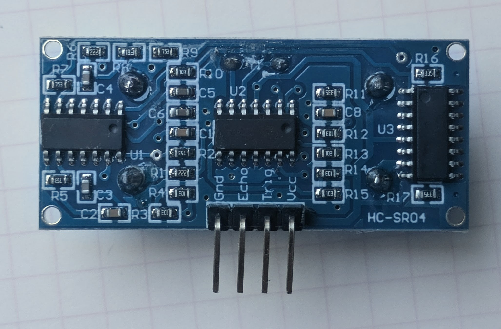
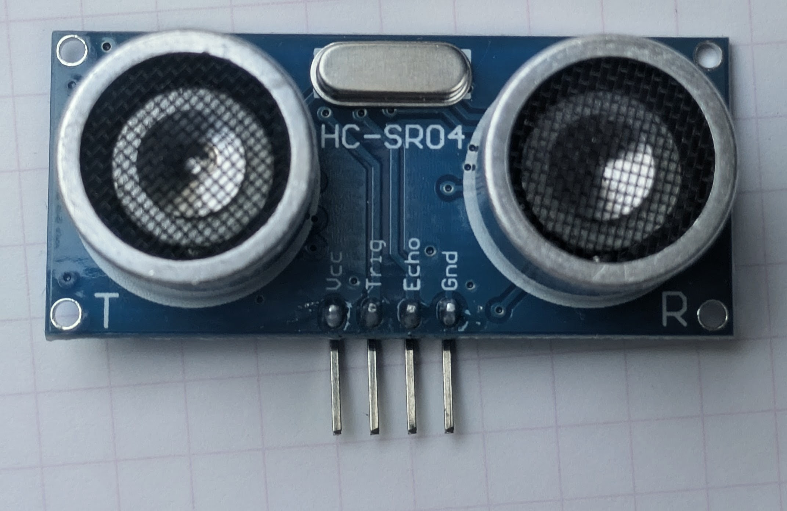

# HC-SR04 Ultrasonic Distance Sensor Driver

A lightweight C++ driver for the HC-SR04 ultrasonic distance sensor, providing non-blocking distance measurements from 2 to 400 cm via GPIO pins on AVR microcontrollers.

| Back                        | Front                        |
|-----------------------------|------------------------------|
|  |  |

## Features

- **Non-blocking measurements**: Returns quickly for objects in range, with configurable timeout for out-of-range
- **Wide measurement range**: 2 cm to ~400 cm (configurable via timeout)
- **Simple API**: Just `setup()` and `read()` for basic usage
- **Accurate**: ±0.3 cm typical accuracy with 0.17 cm step resolution
- **Configurable timeout**: Adjust maximum detection range without modifying code
- **Error reporting**: Clear error codes for sensor failures vs. no object detected
- **Minimal overhead**: Efficient polling with 10 µs step measurements
- **Debug support**: Optional serial debug output via HAS_SERIAL macro
- **Single instance or multiple sensors**: Create multiple HC_SR04 objects for sensor arrays

## Hardware Overview

### Sensor Specifications

| Parameter             | Value                                  |
|-----------------------|----------------------------------------|
| Supply Voltage        | 5V (4.5-5.5V typical)                  |
| Operating Current     | ~15 mA during measurement              |
| Measurement Range     | 2 cm to ~400 cm                        |
| Range Accuracy        | ±0.3 cm                                |
| Resolution            | 0.17 cm per step                       |
| Measurement Frequency | Up to 60 Hz                            |
| Trigger Pulse         | 10 µs minimum (driver uses 12 µs)      |
| Echo Pulse            | 100 µs to ~23 ms depending on distance |
| Ultrasonic Frequency  | 40 kHz                                 |
| Beam Angle            | ~15° (cone)                            |
| Temperature Range     | -20°C to +70°C                         |

### Pin Configuration

```text
HC-SR04 Module:
┌────────────────────┐
│   HC-SR04          │
│                    │
│ VCC  TRIG ECHO GND │
│  |     |     |     |
└──┼─────┼─────┼─────┘
   |     |     |
  +5V   TRIG ECHO  GND
        (MCU)  (MCU)
```

## Installation

### Required Libraries

This driver requires:

- [**gpio.h**](../avrtools/src/gpio.h): GPIO control library (from avrtools module)
- **util/delay.h**: Standard AVR delay library
- [**millisec.h**](../avrtools/src/millisec.h): Millisecond timer library

### File Structure

```text
hcsr04/
├── readme.md           (this file)
└── src/
    ├── hcsr04.h        (header file)
    └── hcsr04.cpp      (implementation)
```

### Adding to Your Project

1. Copy `hcsr04.h` and `hcsr04.cpp` to your project
2. Include the header:

   ```cpp
   #include "hcsr04.h"
   ```

3. Ensure the required libraries are available

## API Reference

### Constructor

#### `HC_SR04(uint8_t trig, uint8_t echo, uint16_t timeout = 20000)`

Creates an HC-SR04 sensor instance with specified trigger and echo pins.

**Parameters:**

- `trig`: Trigger pin number (0-7 for the configured port)
- `echo`: Echo pin number (0-7 for the configured port)
- `timeout`: Maximum echo wait time in microseconds (default: 20000 µs)

**Notes:**

- All pins must be on the same GPIO port (configured by HC_SR04_PORTID macro)
- Default timeout (20000 µs) allows measurements up to ~344 cm
- Must call `setup()` after construction

```cpp
// Trigger on PC0, Echo on PC1, default timeout
HC_SR04 sensor(0, 1);

// Custom timeout for shorter range (faster response)
HC_SR04 sensor_short(0, 1, 5000);   // ~86 cm max

// Custom timeout for longer range (slower response)
HC_SR04 sensor_long(0, 1, 30000);   // ~516 cm max
```

### setup()

#### `void setup()`

Initializes the GPIO pins for the sensor.

**Must be called once before any `read()` calls**

**Configuration:**

- Trigger pin: GPIO output, initialized LOW
- Echo pin: GPIO input with pull-down resistor

```cpp
HC_SR04 sensor(0, 1);
sensor.setup();  // Initialize pins
```

### read()

#### `int16_t read()`

Performs a complete distance measurement cycle.

**Measurement Process:**

1. Sends 12 µs trigger pulse
2. Waits for echo pin to go HIGH (timeout: 6 ms)
3. Measures echo pulse duration (timeout: configured value)
4. Calculates and returns distance

**Returns:**

- **2 to 400**: Distance in centimeters (positive values indicate valid measurement)
- **-1**: Echo startup timeout (sensor not responding)
- **-2**: Echo measurement timeout (object out of range or no object detected)

**Blocking Duration:**

- Successful measurement: ~100 µs to 24 ms (depending on distance)
- Failed measurement: Up to 6 ms + configured timeout

**Notes:**

- Non-blocking for objects in range (returns in <1 ms)
- Can block if timeout is reached without echo
- Do not call more frequently than 60 Hz (minimum 17 ms between calls)
- Measurement accuracy: ±0.3 cm typical

```cpp
// Simple measurement
int16_t distance = sensor.read();

if (distance > 0) {
    printf("Distance: %d cm\n", distance);
} else if (distance == -1) {
    printf("Sensor error: not responding\n");
} else if (distance == -2) {
    printf("No object detected\n");
}
```

### setTimeout()

#### `void setTimeout(uint16_t timeout)`

Configures the maximum echo wait time.

**Parameter:**

- `timeout`: Maximum echo duration in microseconds

**Distance vs. Timeout Table:**

| Maximum Distance (cm) | Required Timeout (µs) |
|-----------------------|-----------------------|
| 100                   | 5,800                 |
| 200                   | 11,600                |
| 300                   | 17,400                |
| 400                   | 23,200                |
| 500                   | 29,000                |

**Formula:** `timeout = max_distance_cm × 58 µs`

```cpp
HC_SR04 sensor(0, 1);
sensor.setup();

// Default 20000 µs allows ~344 cm
int16_t dist = sensor.read();

// Increase range to 500 cm
sensor.setTimeout(30000);
int16_t far_dist = sensor.read();

// Decrease for faster response (max ~86 cm)
sensor.setTimeout(5000);
int16_t quick_dist = sensor.read();
```

## Port Configuration

The driver uses a configurable GPIO port (default: PORTC) for all pins. To use a different port, define `HC_SR04_PORTID` before including the header:

```cpp
#define HC_SR04_PORTID B      // Use PORTB
#include "hcsr04.h"

HC_SR04 sensor(0, 1);  // Now uses PB0 (trigger) and PB1 (echo)
```

## Usage Examples

### Basic Distance Measurement

```cpp
#include "hcsr04.h"
#include <stdio.h>

int main(void) {
    // Initialize sensor
    HC_SR04 sensor(0, 1);  // Trigger=PC0, Echo=PC1
    sensor.setup();

    // Main measurement loop
    while (1) {
        int16_t distance = sensor.read();

        if (distance > 0) {
            printf("Distance: %d cm\n", distance);
        } else if (distance == -1) {
            printf("ERROR: Sensor not responding\n");
        } else if (distance == -2) {
            printf("INFO: No object in range\n");
        }

        _delay_ms(100);  // Wait 100 ms before next measurement
    }

    return 0;
}
```

### Multiple Sensors

```cpp
#include "hcsr04.h"

int main(void) {
    // Create multiple sensor instances
    HC_SR04 front(0, 1);   // Front sensor on PC0/PC1
    HC_SR04 side(2, 3);    // Side sensor on PC2/PC3
    HC_SR04 back(4, 5);    // Back sensor on PC4/PC5

    front.setup();
    side.setup();
    back.setup();

    while (1) {
        int16_t front_dist = front.read();
        int16_t side_dist = side.read();
        int16_t back_dist = back.read();

        printf("Front: %d  Side: %d  Back: %d\n",
               front_dist, side_dist, back_dist);

        _delay_ms(50);
    }

    return 0;
}
```

### Object Detection with Hysteresis

```cpp
#include "hcsr04.h"

#define NEAR_THRESHOLD 20    // cm
#define FAR_THRESHOLD 25     // cm

int main(void) {
    HC_SR04 sensor(0, 1);
    sensor.setup();

    int object_detected = 0;

    while (1) {
        int16_t distance = sensor.read();

        if (distance > 0) {
            // Hysteresis to avoid jitter near threshold
            if (distance < NEAR_THRESHOLD && !object_detected) {
                object_detected = 1;
                printf("Object approaching\n");
            } else if (distance > FAR_THRESHOLD && object_detected) {
                object_detected = 0;
                printf("Object departed\n");
            }
        }

        _delay_ms(20);
    }

    return 0;
}
```

### Obstacle Avoidance for Robot

```cpp
#include "hcsr04.h"

#define DANGER_DISTANCE 15  // cm - stop distance
#define CAUTION_DISTANCE 25 // cm - slow down distance

typedef enum {
    MOVING,
    SLOWING,
    STOPPED
} state_t;

int main(void) {
    HC_SR04 front_sensor(0, 1);
    HC_SR04 side_sensor(2, 3);

    front_sensor.setup();
    side_sensor.setup();

    state_t robot_state = MOVING;

    while (1) {
        int16_t front = front_sensor.read();
        int16_t side = side_sensor.read();

        // Simplified obstacle avoidance logic
        if (front > 0 && front < DANGER_DISTANCE) {
            // Stop immediately
            robot_state = STOPPED;
            // Turn away from obstacle
            if (side > 100) {
                // Obstacle on right, turn left
            }
        } else if (front > 0 && front < CAUTION_DISTANCE) {
            // Slow down
            robot_state = SLOWING;
        } else {
            // Full speed
            robot_state = MOVING;
        }

        _delay_ms(50);
    }

    return 0;
}
```

### Taking Multiple Readings for Averaging

```cpp
#include "hcsr04.h"

#define NUM_SAMPLES 5

int16_t read_average_distance(HC_SR04 &sensor) {
    int32_t sum = 0;
    int valid_readings = 0;

    for (int i = 0; i < NUM_SAMPLES; i++) {
        int16_t distance = sensor.read();

        // Only include valid readings in average
        if (distance > 0) {
            sum += distance;
            valid_readings++;
        }

        _delay_ms(20);
    }

    // Return average or 0 if no valid readings
    if (valid_readings > 0) {
        return (int16_t)(sum / valid_readings);
    } else {
        return 0;
    }
}

int main(void) {
    HC_SR04 sensor(0, 1);
    sensor.setup();

    while (1) {
        int16_t avg_distance = read_average_distance(sensor);

        if (avg_distance > 0) {
            printf("Average distance: %d cm\n", avg_distance);
        } else {
            printf("No valid measurements\n");
        }

        _delay_ms(100);
    }

    return 0;
}
```

## Configuration and Tuning

### Adjusting Measurement Range

```cpp
HC_SR04 sensor(0, 1);
sensor.setup();

// For close-range detection (2-100 cm)
sensor.setTimeout(5800);

// For standard range (2-344 cm, default)
sensor.setTimeout(20000);

// For long-range detection (2-500 cm)
sensor.setTimeout(30000);
```

### Debug Output

To enable debug serial output, uncomment the `#define HAS_SERIAL` line in `hcsr04.cpp`:

```cpp
//#define HAS_SERIAL  // Uncomment to enable debug output
```

This will output via USART:

- "HC-SR04 Trig high" - Trigger pulse started
- "HC-SR04 Trig low" - Trigger pulse ended
- "HC-SR04 Echo high" - Echo response received

### Measurement Frequency

**Recommended:** 20-60 Hz (50 ms to 17 ms between measurements)

- 20 Hz (50 ms): Safe, stable measurements, no interference
- 60 Hz (17 ms): Maximum safe frequency without interference

**Avoid:** Faster than 60 Hz may cause:

- Cross-talk between consecutive measurements
- Erratic readings
- Timeout errors

## Performance Characteristics

### Measurement Time

| Scenario            | Time    | Notes                              |
|---------------------|---------|------------------------------------|
| 10 cm object        | ~200 µs | Echo pulse: ~58 × 10 × 2 = 1160 µs |
| 50 cm object        | ~1 ms   | Echo pulse: ~5,800 µs              |
| 200 cm object       | ~12 ms  | Echo pulse: ~23,200 µs             |
| No object (timeout) | ~26 ms  | 6 ms startup + 20 ms echo timeout  |
| Sensor error        | ~6 ms   | Startup timeout reached            |

### Power Consumption

| Mode                  | Current | Time                          |
|-----------------------|---------|-------------------------------|
| Idle (no measurement) | <1 µA   | -                             |
| During measurement    | ~15 mA  | ~100 µs to 24 ms              |
| Average @ 20 Hz       | ~5 µA   | Includes idle periods         |
| Average @ 60 Hz       | ~15 µA  | Almost continuous measurement |

### Accuracy Factors

| Factor            | Effect                  | Mitigation                       |
|-------------------|-------------------------|----------------------------------|
| Temperature       | ±0.3%/°C                | Temperature compensation         |
| Soft materials    | Absorption              | Use hard reflective surfaces     |
| Angle             | Reduced echo            | Keep object centered in beam     |
| Beam interference | Echo from side surfaces | Clear 30 cm radius around sensor |
| Step resolution   | ±0.17 cm uncertainty    | Average multiple readings        |

## References

- [HC-SR04 Datasheet](https://cdn.sparkfun.com/datasheets/Sensors/Ultrasonic/HC-SR04.pdf)
- [How Ultrasonic Sensors Work](https://www.maxim-integrated.com/en/design/technical-documents/tutorials/3656.html)
- [Speed of Sound Calculator](https://www.omnicalculator.com/physics/speed-of-sound)
- [Ultrasonic Sensor Fundamentals](https://www.electronics-lab.com/project/ultrasonic-sensor-basics/)

## Implementation Notes

### Timing Algorithm

The `read()` method uses a step-based measurement approach:

- Measures echo duration in 10 µs steps
- Applies 5 µs correction factor per step for overhead
- Balances CPU efficiency with measurement accuracy
- Typical resolution: 0.17 cm per step
