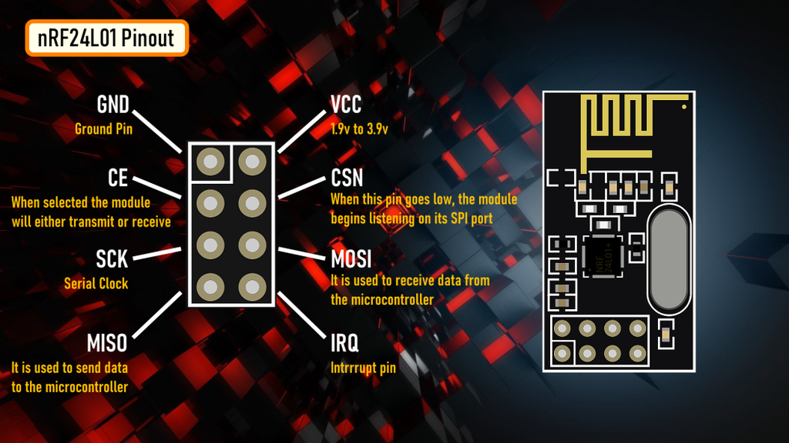

# Introduction to the NRF24L01+ for AVR Microcontrollers

The NRF24L01+ is a low-cost, low-power wireless transceiver module that operates in the 2.4GHz ISM (Industrial, Scientific, and Medical) band. It's a very popular choice for adding wireless communication to projects involving AVR microcontrollers like the ATmega and ATtiny series, largely due to its simplicity and affordability.

## Pinout

.

## Key Features

* **Transceiver:** It can both send and receive data.
* **Interface:** It uses the SPI (Serial Peripheral Interface) protocol for communication, which is a standard hardware peripheral on most AVR MCUs.
* **Low Power:** It has built-in power-saving modes, making it suitable for battery-powered applications.
* **Configurable:** You can programmatically set the data rate (250kbps, 1Mbps, or 2Mbps), transmission power, and communication channel.
* **Multi-device Communication:** Its "MultiCeiver" feature allows one receiver to listen to up to six different transmitters simultaneously using unique addresses called "pipes."

---

### Connecting to an AVR MCU

The module communicates with the AVR using the SPI protocol. The essential pin connections are:

* **VCC:** Power ( **Must be 3.3V** )
* **GND:** Ground
* **CSN (Chip Select Not):** The SPI slave select pin. Connected to any digital I/O pin on the AVR. Set LOW to select.
* **CE (Chip Enable):** Activates the module for transmitting or receiving. Connected to any digital I/O pin on the AVR.
* **SCK (Serial Clock):** Connects to the AVR's SPI clock pin (SCK).
* **MOSI (Master Out Slave In):** Connects to the AVR's MOSI pin.
* **MISO (Master In Slave Out):** Connects to the AVR's MISO pin.
* **IRQ (Interrupt Request):** Optional. Can be connected to an interrupt-capable pin on the AVR to signal when data has been received or sent.

**/!\ Important Consideration for AVR Users:**
> The NRF24L01 is a **3.3V device**. Most common AVRs (like the one in the Arduino Uno) run at 5V.
>
> 1. **Power:** You must power the module from a stable 3.3V source. Do not connect its VCC pin to a 5V supply. Adding a small capacitor (e.g., 10µF) > across VCC and GND close to the module is highly recommended to stabilize the power supply.
> 2. **Logic Levels:** The data pins (CE, CSN, SCK, MOSI) from a 5V AVR can damage the module. You should use a logic level shifter or a simple > voltage divider (for the 5V-to-3.3V data lines) to ensure safe communication.

---

### Programming Workflow

Directly programming the NRF24L01 by writing to its registers can be complex. It is highly recommended to use a well-supported library, as this abstracts away the low-level details. The general workflow in your AVR C/C++ code is:

1. **Initialization:** Include the library and create a radio object, specifying the CE and CSN pins you've chosen.
2. **Configuration:**
    * Initialize the radio object (e.g., `radio.begin()`).
    * Set the communication channel (`radio.setChannel()`).
    * Set the data rate and power level.
3. **Addressing:**
    * To transmit, open a "writing pipe" with a specific address (`radio.openWritingPipe(address)`).
    * To receive, open a "reading pipe" on the same address (`radio.openReadingPipe(1, address)`).
4. **Operation:**
    * **Transmit:** Call `radio.stopListening()`, then send data with `radio.write(&data, sizeof(data))`.
    * **Receive:** Call `radio.startListening()`, check for data with `radio.available()`, and if true, read it with `radio.read(&data, sizeof(data))`.

## NRF24L01+ Register Map

The NRF24L01+ is controlled by reading and writing to its internal registers via the SPI interface. All communication over SPI consists of an 8-bit
command, followed by data. The registers are organized in a memory map from address 0x00 to 0x1D.

Below is a summary of the most important registers.

  | Address | Mnemonic | Register Name | Description |
  | :--- | :--- | :--- | :--- |
  | 0x00 | CONFIG | Configuration Register | The main control register. Used to power up/down, switch between TX/RX modes, and configure CRC and interruptmasks. |
  | 0x01 | EN_AA | Enable Auto-Acknowledgement | Enables the "Enhanced ShockBurst" auto-acknowledgement feature on a per-pipe basis. If a bit is set, the corresponding data pipe will automatically send an ACK packet upon receiving data. |
  | 0x02 | EN_RXADDR | Enabled RX Addresses | Enables or disables data pipes. Bit 0 enables Pipe 0, Bit 1 enables Pipe 1, and so on. To receive data, the corresponding pipe must be enabled here. |
  | 0x03 | SETUP_AW | Setup of Address Widths | Sets the width for the RX/TX addresses. Can be set to 3, 4, or 5 bytes. This must be the same for both the transmitter and receiver. |
  | 0x04 | SETUP_RETR | Setup of Automatic Retransmission | Configures the auto-retransmit feature. You can set the delay between retransmits and the maximum number of retransmit attempts. |
  | 0x05 | RF_CH | RF Channel | Sets the frequency channel the radio operates on. The frequency is calculated as 2400 + RF_CH MHz. This allows you to select one of 126 channels to avoid interference. |
  | 0x06 | RF_SETUP | RF Setup Register | Configures the radio's RF parameters: data rate (250kbps, 1Mbps, 2Mbps) and transmitter output power. |
  | 0x07 | STATUS | Status Register | A crucial read-only register that reports the status of the three main interrupt flags: RX_DR (Data Ready), TX_DS (Data Sent), and MAX_RT (Max Retries reached). It also indicates which data pipe received data. Writing a '1' to the flag bits clears them. |
  | 0x08 | OBSERVE_TX | Transmit Observe Register | Contains counters for lost packets (PLOS_CNT) and retransmitted packets (ARC_CNT). Useful for assessing link quality. |
  | 0x09 | RPD | Received Power Detector | Formerly CD (Carrier Detect). A simple 1-bit flag that indicates if received power in the current channel is greater than -64 dBm. Can be used to scan for activity on a channel. |
  | 0x0A - 0x0F | RX_ADDR_P0 - RX_ADDR_P5 | Receive Address Data Pipe 0-5 | These registers hold the unique addresses for each of the 6 possible data pipes. Pipe 0 has a unique 5-byte address. Pipes 1-5 share the first 4 bytes with Pipe 1 and only have a unique last byte. |
  | 0x10 | TX_ADDR | Transmit Address | The address used when transmitting a packet. For a receiver to get this packet, its RX_ADDR_P0 must be identical to the transmitter's TX_ADDR. |
  | 0x11 - 0x16 | RX_PW_P0 - RX_PW_P5 | Number of Bytes in RX FIFO | Specifies the payload width (1-32 bytes) for the data packet expected on each corresponding data pipe. If dynamic payload length is enabled, this is ignored. |
  | 0x17 | FIFO_STATUS | FIFO Status Register | Provides the status of the TX and RX First-In-First-Out buffers, indicating if they are full or empty. |
  | 0x1C | DYNPD | Enable Dynamic Payload Length | Enables dynamic payload length on a per-pipe basis. This allows the transmitter to send packets of varying sizes to a receiver. |
  | 0x1D | FEATURE | Feature Register | Used to enable advanced features like dynamic payload length, payload with ACK, and the W_TX_PAYLOAD_NOACK command. These features must be activated before they can be used. |

  ---

### NRF24L01+ Detailed Register Description

This document provides a detailed, bit-by-bit description of the memory-mapped registers for the NRF24L01+ transceiver. All control and configuration is performed by reading from and writing to these registers via an SPI interface.

---

#### `0x00`: CONFIG - Configuration Register

This is the primary register for controlling the module's core functions.

| Bit | Mnemonic | R/W | Description |
|:---:|:---|:---:|:---|
| 7 | (Reserved) | R | Reserved. Keep as 0. |
| 6 | `MASK_RX_DR` | R/W | **Mask interrupt caused by RX_DR**. `1`: Interrupt disabled. `0`: Interrupt enabled on the IRQ pin when new data arrives (`RX_DR` in `STATUS` is set). |
| 5 | `MASK_TX_DS` | R/W | **Mask interrupt caused by TX_DS**. `1`: Interrupt disabled. `0`: Interrupt enabled on the IRQ pin when a packet is successfully transmitted (`TX_DS` in `STATUS` is set). |
| 4 | `MASK_MAX_RT`| R/W | **Mask interrupt caused by MAX_RT**. `1`: Interrupt disabled. `0`: Interrupt enabled on the IRQ pin when the maximum number of retransmit attempts is reached (`MAX_RT` in `STATUS` is set). |
| 3 | `EN_CRC` | R/W | **Enable CRC**. `1`: CRC is forced on for all transmissions. `0`: CRC disabled. It is highly recommended to keep this enabled. If `EN_AA` is enabled for any pipe, this bit is automatically forced to 1. |
| 2 | `CRCO` | R/W | **CRC Encoding Scheme**. `0`: 1-byte CRC. `1`: 2-byte CRC. |
| 1 | `PWR_UP` | R/W | **Power Control**. `1`: Power Up. `0`: Power Down. When powering up, the module enters Standby-I mode. |
| 0 | `PRIM_RX` | R/W | **RX/TX Control**. `1`: PRX (Primary Receiver). The module actively listens for incoming data. `0`: PTX (Primary Transmitter). The module is in transmit mode. |

---

#### `0x01`: EN_AA - Enable Auto-Acknowledgement

Enables the "Enhanced ShockBurst" auto-acknowledgement (ACK) feature for each data pipe.

| Bit | Mnemonic | R/W | Description |
|:---:|:---|:---:|:---|
| 7:6 | (Reserved) | R | Reserved. Keep as 0. |
| 5 | `ENAA_P5` | R/W | Enable auto-acknowledgement for Data Pipe 5. |
| 4 | `ENAA_P4` | R/W | Enable auto-acknowledgement for Data Pipe 4. |
| 3 | `ENAA_P3` | R/W | Enable auto-acknowledgement for Data Pipe 3. |
| 2 | `ENAA_P2` | R/W | Enable auto-acknowledgement for Data Pipe 2. |
| 1 | `ENAA_P1` | R/W | Enable auto-acknowledgement for Data Pipe 1. |
| 0 | `ENAA_P0` | R/W | Enable auto-acknowledgement for Data Pipe 0. |

---

#### `0x02`: EN_RXADDR - Enabled RX Addresses

Enables or disables the six data pipes for reception.

| Bit | Mnemonic | R/W | Description |
|:---:|:---|:---:|:---|
| 7:6 | (Reserved) | R | Reserved. Keep as 0. |
| 5 | `ERX_P5` | R/W | Enable Data Pipe 5. |
| 4 | `ERX_P4` | R/W | Enable Data Pipe 4. |
| 3 | `ERX_P3` | R/W | Enable Data Pipe 3. |
| 2 | `ERX_P2` | R/W | Enable Data Pipe 2. |
| 1 | `ERX_P1` | R/W | Enable Data Pipe 1. |
| 0 | `ERX_P0` | R/W | Enable Data Pipe 0. |

---

#### `0x03`: SETUP_AW - Setup of Address Widths

Defines the byte-width of the address used for all data pipes.

| Bit | Mnemonic | R/W | Description |
|:---:|:---|:---:|:---|
| 7:2 | (Reserved) | R | Reserved. Keep as 0. |
| 1:0 | `AW` | R/W | **RX/TX Address field width**. `00`: Illegal. `01`: 3 bytes. `10`: 4 bytes. `11`: 5 bytes. Must be the same for transmitter and receiver. |

---

#### `0x04`: SETUP_RETR - Setup of Automatic Retransmission

Configures the behavior of the auto-retransmit functionality.

| Bit | Mnemonic | R/W | Description |
|:---:|:---|:---:|:---|
| 7:4 | `ARD` | R/W | **Auto Retransmit Delay**. `0000`: 250µS, `0001`: 500µS, `0010`: 750µS, ..., `1111`: 4000µS. The delay is measured from the end of a packet transmission to the start of the next retransmission. |
| 3:0 | `ARC` | R/W | **Auto Retransmit Count**. `0000`: Retransmit disabled. `0001`: Up to 1 retransmit on fail of AA. ..., `1111`: Up to 15 retransmits. |

---

#### `0x05`: RF_CH - RF Channel

Sets the operating frequency channel.

| Bit | Mnemonic | R/W | Description |
|:---:|:---|:---:|:---|
| 7 | (Reserved) | R | Reserved. Keep as 0. |
| 6:0 | `RF_CH` | R/W | **Sets the frequency channel**. The frequency is `(2400 + RF_CH) MHz`. Allows values from 0 to 125. |

---

#### `0x06`: RF_SETUP - RF Setup Register

Configures key RF parameters like data rate and output power.

| Bit | Mnemonic | R/W | Description |
|:---:|:---|:---:|:---|
| 7:6 | (Reserved) | R | Reserved. Keep as 0. |
| 5 | `CONT_WAVE` | R/W | Enables continuous carrier transmit when set. Used for testing purposes. |
| 4 | (Reserved) | R | Reserved. Keep as 0. |
| 3 | `RF_DR_LOW` | R/W | **Sets the air data rate**. See `RF_DR_HIGH`. |
| 2:1 | `RF_PWR` | R/W | **Set RF output power**. `00`: -18dBm, `01`: -12dBm, `10`: -6dBm, `11`: 0dBm. |
| 0 | `RF_DR_HIGH`| R/W | **Selects the air data rate**. Combination of `RF_DR_LOW` (bit 5) and `RF_DR_HIGH` (bit 3): `[RF_DR_LOW, RF_DR_HIGH]` -> `[0,0]`: 1Mbps. `[0,1]`: 2Mbps. `[1,0]`: 250kbps. `[1,1]`: Reserved. |

---

#### `0x07`: STATUS - Status Register

A read-only register that provides critical status information. It is also returned on every SPI command. Writing '1' to the interrupt flag bits will clear them.

| Bit | Mnemonic | R/W | Description |
|:---:|:---|:---:|:---|
| 7 | (Reserved) | R | Reserved. |
| 6 | `RX_DR` | R/C | **Data Ready RX FIFO interrupt**. Set when new data arrives in the RX FIFO. Write 1 to clear. |
| 5 | `TX_DS` | R/C | **Data Sent TX FIFO interrupt**. Set when a packet is successfully transmitted with auto-ack. Write 1 to clear. |
| 4 | `MAX_RT` | R/C | **Maximum number of TX retransmits reached**. If `EN_AA` is enabled, this is set when the retransmit limit is hit. Write 1 to clear. |
| 3:1 | `RX_P_NO` | R | **Data pipe number for the payload available in RX FIFO**. `000-101`: Pipe 0-5. `110`: Not used. `111`: RX FIFO Empty. |
| 0 | `TX_FULL` | R | **TX FIFO full flag**. `1`: TX FIFO is full. `0`: TX FIFO is not full. |

---

#### `0x08`: OBSERVE_TX - Transmit Observe Register

Allows for monitoring the quality of the wireless link.

| Bit | Mnemonic | R/W | Description |
|:---:|:---|:---:|:---|
| 7:4 | `PLOS_CNT` | R | **Packet Loss Counter**. Counts the number of lost packets since the last channel change. Counter is reset by writing to `RF_CH`. |
| 3:0 | `ARC_CNT` | R | **Retransmitted Packet Counter**. Counts the number of times the current packet has been retransmitted. Counter is reset when a new transmission starts. |

---

#### `0x09`: RPD - Received Power Detector

Detects if there is a signal present on the current channel.

| Bit | Mnemonic | R/W | Description |
|:---:|:---|:---:|:---|
| 7:1 | (Reserved) | R | Reserved. |
| 0 | `RPD` | R | **Received Power Detector**. `1`: Received power > -64 dBm. `0`: Received power < -64 dBm. |

---

#### `0x0A` to `0x10`: Address Registers

* **`0x0A`: RX_ADDR_P0** (Up to 5 bytes) - Receive address for data pipe 0.
* **`0x0B`: RX_ADDR_P1** (Up to 5 bytes) - Receive address for data pipe 1.
* **`0x0C`: RX_ADDR_P2** (1 byte) - Receive address for data pipe 2. Only the LSB is unique. The upper bytes are shared with `RX_ADDR_P1`.
* **`0x0D`: RX_ADDR_P3** (1 byte) - Receive address for data pipe 3.
* **`0x0E`: RX_ADDR_P4** (1 byte) - Receive address for data pipe 4.
* **`0x0F`: RX_ADDR_P5** (1 byte) - Receive address for data pipe 5.
* **`0x10`: TX_ADDR** (Up to 5 bytes) - Transmit address. Must be the same as the receiver's `RX_ADDR_P0` for an acknowledged packet.

---

#### `0x11` to `0x16`: Payload Width Registers

* **`0x11`: RX_PW_P0** - Number of bytes in RX payload for Pipe 0 (1-32).
* **`0x12`: RX_PW_P1** - Number of bytes in RX payload for Pipe 1 (1-32).
* ...and so on for pipes 2, 3, 4, and 5.
* A value of `0` disables the pipe. If dynamic payload length is enabled for a pipe, this setting is ignored for that pipe.

---

#### `0x17`: FIFO_STATUS - FIFO Status Register

Provides the status of the TX and RX FIFO buffers.

| Bit | Mnemonic | R/W | Description |
|:---:|:---|:---:|:---|
| 7 | (Reserved) | R | Reserved. |
| 6 | `TX_REUSE` | R | **Reuse last transmitted payload**. `1`: Pulse the `REUSE_TX_PL` command to reuse the last payload. The `TX_REUSE` bit is cleared by the `W_TX_PAYLOAD` or `FLUSH_TX` command. |
| 5 | `TX_FULL` | R | **TX FIFO full flag**. `1`: TX FIFO is full. `0`: Not full. |
| 4 | `TX_EMPTY` | R | **TX FIFO empty flag**. `1`: TX FIFO is empty. `0`: Not empty. |
| 3:2 | (Reserved) | R | Reserved. |
| 1 | `RX_FULL` | R | **RX FIFO full flag**. `1`: RX FIFO is full. `0`: Not full. |
| 0 | `RX_EMPTY` | R | **RX FIFO empty flag**. `1`: RX FIFO is empty. `0`: Not empty. |

---

#### `0x1C`: DYNPD - Enable Dynamic Payload Length

Enables dynamic payload length on a per-pipe basis. This allows the transmitter to send packets of varying sizes (1-32 bytes).

| Bit | Mnemonic | R/W | Description |
|:---:|:---|:---:|:---|
| 7:6 | (Reserved) | R | Reserved. |
| 5 | `DPL_P5` | R/W | Enable dynamic payload length for Data Pipe 5. |
| 4 | `DPL_P4` | R/W | Enable dynamic payload length for Data Pipe 4. |
| ... | ... | ... | ... |
| 0 | `DPL_P0` | R/W | Enable dynamic payload length for Data Pipe 0. |

---

#### `0x1D`: FEATURE - Feature Register

Activates special features. These bits can only be set when the module is in power-down or standby mode.

| Bit | Mnemonic | R/W | Description |
|:---:|:---|:---:|:---|
| 7:3 | (Reserved) | R | Reserved. |
| 2 | `EN_DPL` | R/W | **Enables Dynamic Payload Length**. Must be set to use the `DYNPD` register. |
| 1 | `EN_ACK_PAY`| R/W | **Enables Payload with ACK**. Allows you to send a custom payload back to the transmitter along with the ACK packet. |
| 0 | `EN_DYN_ACK`| R/W | **Enables W_TX_PAYLOAD_NOACK command**. Allows you to send a packet without requiring an acknowledgement on a per-packet basis. |
