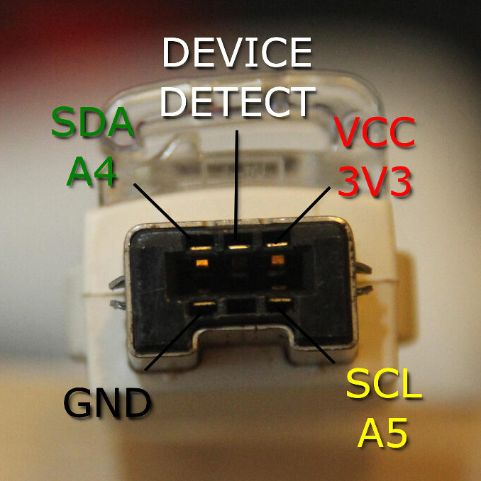

# Wii Nunchuk AVR Driver - User Manual

## Overview

This library provides a complete driver for the Nintendo Wii Nunchuk controller connected via I2C bus. The Nunchuk is a wireless controller that integrates a joystick, 3-axis accelerometer, and two buttons (C and Z), making it an excellent input device for AVR microcontroller projects.

The library handles all communication protocol details, including device initialization, calibration data retrieval, data decoding, and sensor readings. It provides convenient methods to access joystick position, acceleration values, button states, and calculated tilt angles. I2C communication rely on TinyI2CMaster class from [i2c](../i2c/readme.md) library.

**Key Features:**

- I2C communication with automatic device detection
- Full calibration data retrieval and storage
- Joystick position reading with directional analysis
- 3-axis accelerometer with gravity-calibrated output
- Calculated tilt angles (roll, pitch, yaw)
- Button state detection (C and Z buttons)
- Change detection in `update()` method
- Optional serial debug output

---

## Hardware Setup

### Wiring Diagram

The Nunchuk connects to your AVR microcontroller via I2C. Use a standard Wii Nunchuk connector with the following pinout:



```text
Nunchuk Connector (looking at connector):
  Pin 1: GND (White wire)
  Pin 2: VCC (Red wire)
  Pin 3: SCL (Green wire)
  Pin 4: SDA (Yellow wire)
```

### Connection Example

Connect to ATtiny84 or ATmega328P I2C pins:

| Nunchuk Pin | Signal | ATtiny84 | ATmega328P |
|-------------|--------|----------|------------|
| 1           | GND    | GND      | GND        |
| 2           | VCC    | VCC      | VCC        |
| 3           | SCL    | PB2      | PC5        |
| 4           | SDA    | PB0      | PC4        |

**Note:** Pull-up resistors (4.7kΩ) are typically needed on SCL and SDA lines. Many Nunchuk adapters include these internally.

---

## Getting Started

### 1. Include the Header

```cpp
#include <nunchuk.h>
```

### 2. Create a Nunchuk Object

```cpp
Nunchuk joystick;
```

### 3. Initialize the Device

```cpp
if (!joystick.initialize()) {
    // Handle initialization error
    Serial.println("Nunchuk not found!");
} else {
    Serial.println("Nunchuk initialized successfully.");
}
```

The `initialize()` method:

- Establishes I2C communication
- Configures the device in unencrypted data mode
- Verifies the device ID
- Retrieves and stores calibration data

### 4. Read Sensor Data Periodically

```cpp
void loop() {
    if (joystick.update()) {
        // Joystick position or button state changed
        Serial.println("Input detected!");
    }
    
    // Read joystick position
    uint8_t x = joystick.joystick_x();
    uint8_t y = joystick.joystick_y();
    
    // Read buttons
    if (joystick.z_button()) {
        Serial.println("Z button pressed!");
    }
    
    delay(50);  // Poll at 50ms
}
```

---

## API Reference

### Initialization & Updates

#### `bool initialize()`

Initializes the Nunchuk controller and retrieves calibration data.

**Returns:** `true` if successful, `false` if device not found or communication error.

**Example:**

```cpp
if (!joystick.initialize()) {
    // Handle error
}
```

---

#### `bool update()`

Reads current sensor data from the Nunchuk and detects changes.

**Returns:** `true` if joystick position or button state changed since last update, `false` otherwise.

**Notes:**

- Should be called periodically in your main loop
- Recommended polling interval: 20-50 Hz (50-20 ms)
- Uses change detection for efficient event handling

**Example:**

```cpp
void loop() {
    if (joystick.update()) {
        // React to input changes
        handle_nunchuk_input();
    }
    delay(50);
}
```

---

### Joystick Data Access

#### `uint8_t joystick_x()`

#### `uint8_t joystick_y()`

Read raw joystick position values.

**Returns:** Position value (0-255), where 128 is center.

**Example:**

```cpp
uint8_t x = joystick.joystick_x();  // 0 = far left, 128 = center, 255 = far right
uint8_t y = joystick.joystick_y();  // 0 = down, 128 = center, 255 = up
```

---

#### `uint8_t joystick_strength()`

Calculate the joystick displacement magnitude from the center.

**Returns:** Strength value (0-255), where 0 is at center and 255 is maximum displacement.

**Uses:** Calibration data to normalize the position relative to the center point.

**Example:**

```cpp
uint8_t strength = joystick.joystick_strength();
if (strength > 200) {
    Serial.println("Strong stick deflection!");
}
```

---

#### `char get_joystick_position()`

Determine the joystick's directional position.

**Returns:** One of the following characters:

- **^** - North (up)
- **/** - North-East (up-right)
- **>** - East (right)
- **`** - South-East (down-right)
- **v** - South (down)
- **,** - South-West (down-left)
- **<** - West (left)
- **\\** - North-West (up-left)
- **x** - Center
- **?** - Unknown/out of range

**Example:**

```cpp
char position = joystick.get_joystick_position();
Serial.println(position);  // Prints: >, v, <, ^, etc.
```

---

### Joystick Calibration Data

The library automatically retrieves and stores calibration limits for the joystick during initialization.

#### `uint8_t joystick_x_min()` / `joystick_x_max()` / `joystick_x_center()`

#### `uint8_t joystick_y_min()` / `joystick_y_max()` / `joystick_y_center()`

Access calibration data for X and Y axes.

**Example:**

```cpp
Serial.print("X range: ");
Serial.print(joystick.joystick_x_min());
Serial.print(" to ");
Serial.println(joystick.joystick_x_max());
```

---

### Button Access

#### `bool z_button()`

#### `bool c_button()`

Check if a button is currently pressed.

**Returns:** `true` if button pressed, `false` otherwise.

**Note:** Button logic is inverted in the Nunchuk protocol (active-low), but the library handles this internally.

**Example:**

```cpp
if (joystick.z_button()) {
    Serial.println("Z button pressed!");
}

if (joystick.c_button()) {
    Serial.println("C button pressed!");
}
```

---

### Accelerometer Data Access

#### Raw Acceleration (10-bit values)

##### `int16_t x_acceleration()`

##### `int16_t y_acceleration()`

##### `int16_t z_acceleration()`

Read raw 10-bit acceleration values from the accelerometer.

**Returns:** Raw acceleration value (typically 0-1023).

**Notes:**

- These are uncalibrated values
- Use the `*_g()` methods for calibrated gravity-based values
- Useful for direct hardware-level debugging

**Example:**

```cpp
int16_t raw_x = joystick.x_acceleration();  // Raw 10-bit value
```

---

#### Calibrated Acceleration (Gravity Units)

##### `float x_g()`

##### `float y_g()`

##### `float z_g()`

Read acceleration in units of gravitational acceleration (g).

**Returns:** Acceleration in g, where 1g ≈ 9.8 m/s².

**Notes:**

- Values are calibrated using device-specific calibration data
- Positive/negative direction depends on axis orientation
- More useful than raw values for application logic

**Example:**

```cpp
float accel_x = joystick.x_g();  // Acceleration in g
if (abs(accel_x) > 1.5) {
    Serial.println("Strong acceleration on X axis!");
}
```

**Axis Directions (Standard Orientation):**

- **X-axis:** Positive = forward/right, Negative = backward/left
- **Y-axis:** Positive = rightward, Negative = leftward  
- **Z-axis:** Positive = upward, Negative = downward

---

### Tilt Angle Calculations

The library calculates tilt angles from the accelerometer data using the arctangent function.

#### `int16_t x_tilt()`

#### `int16_t y_tilt()`

#### `int16_t z_tilt()`

Calculate orientation angles around each axis.

**Returns:** Tilt angle in degrees (-180 to 180, or 0 to 180 for z_tilt).

**Use Cases:**

- **x_tilt():** Forward/backward tilt (pitch) or roll around the X axis
- **y_tilt():** Left/right tilt (roll) or pitch around the Y axis
- **z_tilt():** Rotation around Z axis (yaw)

**Example:**

```cpp
int16_t pitch = joystick.x_tilt();  // Forward/backward tilt
int16_t roll = joystick.y_tilt();   // Left/right tilt
int16_t yaw = joystick.z_tilt();    // Rotation

if (abs(pitch) > 45) {
    Serial.println("Device tilted forward more than 45°");
}
```

---

### Debug Output

#### `void display()`

Output current sensor readings to the serial port (if HAS_SERIAL is defined).

Displays:

- Joystick X and Y position
- Raw acceleration on all three axes
- Button states (C and Z)

**Example:**

```cpp
joystick.display();
// Output:
// Joystick: 128, 140
// Accel: 523, 510, 512
// Buttons: C=no, Z=yes
```

---

#### `void display_calibration()`

Output calibration data to the serial port (if HAS_SERIAL is defined).

Displays:

- Joystick calibration limits (min, center, max for X and Y)
- Accelerometer calibration data (0g and 1g reference values)
- Resolution factors (conversion to g units)

**Example:**

```cpp
joystick.display_calibration();
// Output:
// Joystick Calibration:
// X: min=28, center=130, max=230
// Y: min=30, center=128, max=228
// ...
```

---

## Complete Example

```cpp
#include <avr/io.h>
#include <stdio.h>
#include <nunchuk.h>

// Create Nunchuk object
Nunchuk nunchuk;

void setup() {
    // Initialize serial communication (assuming HAS_SERIAL is defined)
    Serial.begin(9600);
    
    // Initialize I2C and Nunchuk
    if (!nunchuk.initialize()) {
        Serial.println("ERROR: Nunchuk not found!");
        while(1);  // Halt
    }
    
    Serial.println("Nunchuk initialized successfully!");
    nunchuk.display_calibration();  // Show calibration data
}

void loop() {
    // Update sensor readings
    if (nunchuk.update()) {
        // Input changed, process it
        
        // Check joystick position
        char pos = nunchuk.get_joystick_position();
        uint8_t strength = nunchuk.joystick_strength();
        
        Serial.print("Joystick: ");
        Serial.print(pos);
        Serial.print(" (strength: ");
        Serial.print(strength);
        Serial.println(")");
        
        // Check buttons
        if (nunchuk.z_button()) {
            Serial.println("Z button pressed");
        }
        if (nunchuk.c_button()) {
            Serial.println("C button pressed");
        }
        
        // Display acceleration
        Serial.print("Accel (g): ");
        Serial.print(nunchuk.x_g());
        Serial.print(", ");
        Serial.print(nunchuk.y_g());
        Serial.print(", ");
        Serial.println(nunchuk.z_g());
        
        // Display tilt angles
        Serial.print("Tilt (°): ");
        Serial.print(nunchuk.x_tilt());
        Serial.print(", ");
        Serial.print(nunchuk.y_tilt());
        Serial.print(", ");
        Serial.println(nunchuk.z_tilt());
    }
    
    delay(50);  // Poll at 20 Hz
}
```

---

## Typical Use Cases

### 1. Simple Button Detection

```cpp
void loop() {
    if (nunchuk.update()) {
        if (nunchuk.z_button()) {
            // Do something when Z is pressed
            activate_feature();
        }
    }
    delay(50);
}
```

### 2. Joystick-Based Navigation

```cpp
void loop() {
    if (nunchuk.update()) {
        char direction = nunchuk.get_joystick_position();
        
        switch(direction) {
            case '^': move_forward(); break;
            case 'v': move_backward(); break;
            case '<': turn_left(); break;
            case '>': turn_right(); break;
            case 'x': stop(); break;
        }
    }
    delay(50);
}
```

### 3. Gesture Detection Using Acceleration

```cpp
void loop() {
    if (nunchuk.update()) {
        float accel_x = nunchuk.x_g();
        float accel_y = nunchuk.y_g();
        
        // Detect shake
        if (abs(accel_x) > 2.0 || abs(accel_y) > 2.0) {
            on_shake_detected();
        }
    }
    delay(50);
}
```

### 4. Orientation-Based Control

```cpp
void loop() {
    if (nunchuk.update()) {
        int16_t pitch = nunchuk.x_tilt();
        int16_t roll = nunchuk.y_tilt();
        
        // Control based on device orientation
        if (pitch > 30) {
            tilt_forward();
        } else if (pitch < -30) {
            tilt_backward();
        }
    }
    delay(50);
}
```

---

## Troubleshooting

### Nunchuk Not Detected

**Symptom:** `initialize()` returns `false`

**Possible Causes:**

1. **I2C wiring issues**
   - Check SCL and SDA connections
   - Verify pull-up resistors are present (4.7kΩ typical)
   - Look for loose connections

2. **Power supply**
   - Verify 3.3V supply to Nunchuk
   - Check for power loss under load

3. **I2C bus conflicts**
   - Ensure no other devices are pulling the bus
   - Check I2C initialization in your main code

**Solutions:**

- Test I2C communication with a bus scanner sketch
- Use an oscilloscope to verify SCL/SDA signals
- Try a different Nunchuk controller

---

### Erratic Joystick Readings

**Symptom:** Joystick values jump around or seem uncalibrated

**Possible Causes:**

1. **Calibration data not retrieved**
   - `initialize()` must complete successfully
   - Check that calibration memory is readable

2. **Electrical noise**
   - EMI from nearby devices
   - Long I2C wires without proper shielding

**Solutions:**

- Add ferrite beads or capacitors to I2C lines
- Keep I2C wires short and twisted together
- Move away from sources of electromagnetic interference

---

### Accelerometer Values Always at 0 or Constant

**Symptom:** Acceleration readings don't change when moving the device

**Possible Causes:**

1. **Device not being read**
   - `update()` not being called
   - I2C communication issue

2. **Calibration data issue**
   - Calibration 0g or 1g reference values are wrong

**Solutions:**

- Verify `update()` is called in your main loop
- Test with `display()` to see raw acceleration values
- Check calibration with `display_calibration()`

---

### I2C Communication Errors

**Symptom:** Library compiles but device doesn't initialize

**Possible Causes:**

1. **I2C peripheral not enabled**
   - TWI/I2C module not initialized on microcontroller
   - Check your I2C initialization code

2. **Wrong device address**
   - Nunchuk uses I2C address 0x52
   - Some adapters may require 0xA4

**Solutions:**

- Ensure TWI/I2C is properly initialized before calling `nunchuk.initialize()`
- Test with raw I2C read/write commands to verify bus communication

---

## Technical Details

### I2C Protocol

- **Device Address:** 0x52 (7-bit) / 0xA4 (8-bit)
- **Data Format:** 6 bytes per read, updated ~100 Hz
- **Power Consumption:** ~30 mA

### Sensor Specifications

**Joystick:**

- Range: 0-255 per axis
- Center: ~128 (varies by device)
- Resolution: 8-bit

**Accelerometer:**

- Range: ±2g typical
- Resolution: 10-bit
- Output: 100 Hz sampling

**Buttons:**

- Z and C buttons (active-low logic)

### Memory Usage

- Runtime storage: ~50 bytes (calibration data + buffers)
- Flash: ~4-6 KB (library code)

---

## References

- Sensor Datasheets: See [AN3461.pdf](./AN3461.pdf) and [Nunchuck-datasheet-FR.pdf](./Nunchuck-datasheet-FR.pdf) in the library directory

---

## Support & Contributing

For issues, improvements, or questions:

1. Check the troubleshooting section
2. Review the code comments in `nunchuk.h` and `nunchuk.cpp`
3. Test with the `display()` and `display_calibration()` debug methods
