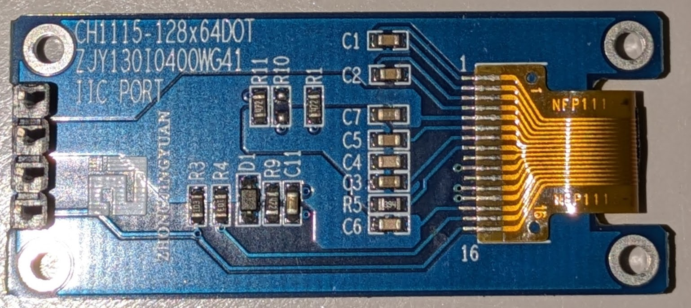
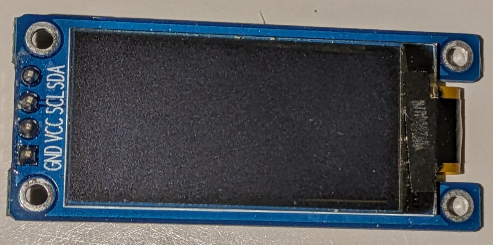
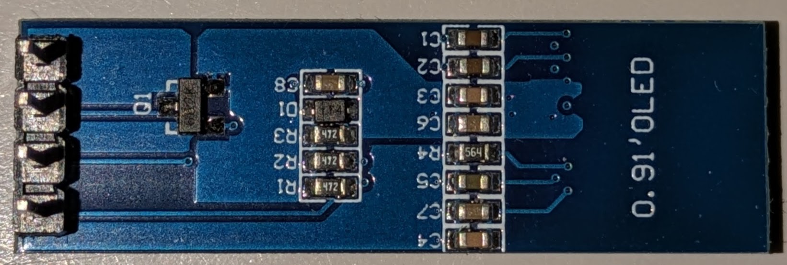
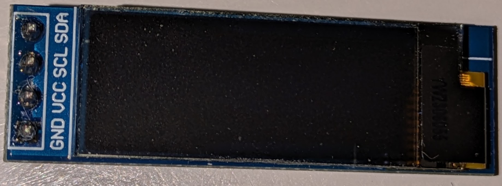
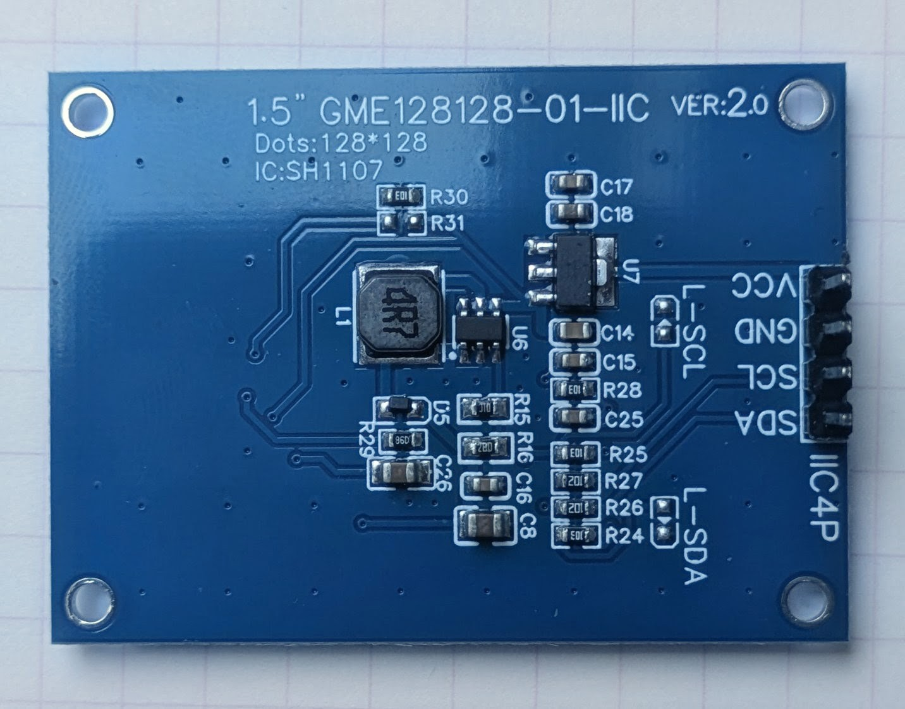
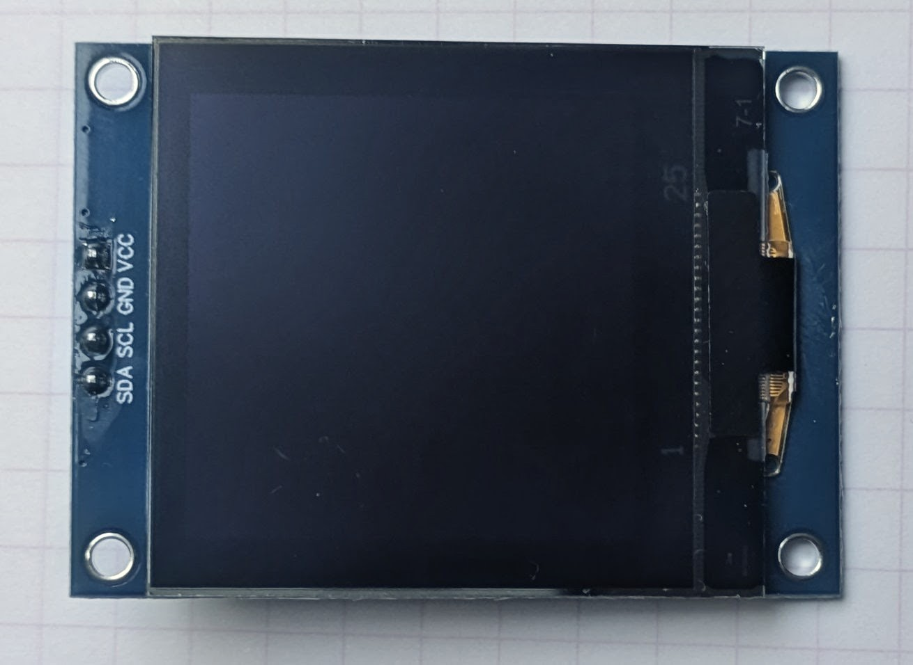

# OLED Display Driver User Manual

## Table of Contents

1. [Introduction](#introduction)
2. [Supported Displays](#supported-displays)
3. [CH1115 vs SSD1306 Comparison](#ch1115-vs-ssd1306-comparison)
4. [Hardware Requirements](#hardware-requirements)
5. [Getting Started](#getting-started)
6. [Basic Initialization](#basic-initialization)
7. [API Reference](#api-reference)
8. [Drawing Functions](#drawing-functions)
9. [Text Rendering](#text-rendering)
10. [Display Control](#display-control)
11. [Special Features](#special-features)
12. [Constants and Definitions](#constants-and-definitions)
13. [Usage Examples](#usage-examples)

---

## Introduction

This library provides a unified interface for controlling OLED displays using I2C communication. It supports two popular display types: **CH1115** and **SSD1306**, making it flexible for various embedded projects. The library is optimized for AVR microcontrollers and includes support for drawing primitives, text rendering, sprites, and advanced display effects.

### Features

- Support for CH1115 and SSD1306 OLED displays
- I2C communication interface
- Drawing primitives (pixels, lines, sprites)
- Text rendering with bitmap fonts
- Display control (contrast, brightness, inversion)
- Scrolling effects (horizontal, vertical, continuous, single-shot)
- Special effects (breathing effect, page-based drawing)
- Efficient memory management for AVR devices

---

## Supported Displays

### CH1115 Display

- **Type**: Monochrome OLED
- **Default I2C Address**: `0x3C` (or `0x3D` if SA0 pin is set high)
- **Device ID**: `0x15`
- **Size**: 128x64
- **Features**: Breathing effect support, multiple scroll modes
- **Class**: `CH1115Display`

| Back                        | Front                        |
|-----------------------------|------------------------------|
|  |  |

### SSD1306 Display

- **Type**: Monochrome OLED
- **Default I2C Address**: `0x3C` (or `0x3D` if SA0 pin is set high)
- **Device ID**: `0x15`
- **Size**: 128x32
- **Features**: Single-shot scroll, vertical scrolling
- **Class**: `SSD1306Display`

| Back                        | Front                        |
|-----------------------------|------------------------------|
|  |  |

### CH1115 vs SSD1306 Comparison

See [CH1115_vs_SSD1306.md](./CH1115_vs_SSD1306.md) for a detailed comparison of features, differences, and porting guidance.

### SH1107 Display

- **Type**: Monochrome OLED (similar to CH1115)
- **Default I2C Address**: `0x3C` (or `0x3D` if SA0 pin is set high)
- **Device ID**: `0x15`
- **Size**: 128x128
- **Features**: Single-shot scroll, vertical scrolling
- **Class**: `SH1107Display`

| Back                        | Front                        |
|-----------------------------|------------------------------|
|  |  |

---

## Hardware Requirements

### Minimum Requirements

- AVR Microcontroller (e.g., ATmega1284p) with I2C (TWI) support
- OLED Display Module (CH1115 or SSD1306)
- I2C pull-up resistors (typically 4.7kΩ) on SDA and SCL lines
- Power supply for display (3.3V or 5V depending on module)

### Pin Connections

```text
Microcontroller    →    OLED Module
GND                →    GND
VCC (3.3V or 5V)  →    VCC
SDA (I2C)          →    SDA
SCL (I2C)          →    SCL
```

---

## Getting Started

### Step 1: Include the Library

```cpp
#include "CH1115Display.h"  // For CH1115 displays
// OR
#include "SSD1306Display.h" // For SSD1306 displays
```

### Step 2: Create Display Object

```cpp
// For a 128x64 display
CH1115Display display(128, 64);
// OR
SSD1306Display display(128, 64);
```

### Step 3: Initialize the Display

```cpp
display.init();              // Initialize with default contrast (0x80)
// OR
display.init(0x9F);          // Initialize with custom contrast
```

---

## Basic Initialization

### Constructor

```cpp
CH1115Display(uint8_t width, uint8_t height);
SSD1306Display(uint8_t width, uint8_t height);
```

Creates a display object with the specified dimensions.

**Parameters:**

- `width`: Display width in pixels (e.g., 128)
- `height`: Display height in pixels (e.g., 64)

### Initialization

```cpp
void init(uint8_t contrast = 0x80);
```

Initializes the I2C communication and configures the display.

**Parameters:**

- `contrast`: Contrast level (0x00 to 0xFF, default: 0x80)

**Example:**

```cpp
CH1115Display display(128, 64);
display.init(0x80);  // Initialize with medium contrast
```

---

## API Reference

### Display Control Functions

#### `enable(uint8_t on)`

Turns the display on or off.

**Parameters:**

- `on`: `CH1115_ON` (1) to turn on, `CH1115_OFF` (0) to turn off

**Example:**

```cpp
display.enable(CH1115_ON);   // Turn display on
display.enable(CH1115_OFF);  // Turn display off (power saving mode)
```

#### `contrast(uint8_t contrast)`

Sets the display contrast.

**Parameters:**

- `contrast`: Contrast level (0x00 to 0xFF)

**Example:**

```cpp
display.contrast(0x80);  // Medium contrast
display.contrast(0xFF);  // Maximum contrast
```

#### `invert(uint8_t on)`

Inverts all display colors (white becomes black and vice versa).

**Parameters:**

- `on`: `1` to enable inversion, `0` to disable

**Example:**

```cpp
display.invert(1);  // Invert colors
display.invert(0);  // Normal colors
```

#### `flip(uint8_t on)`

Flips the display upside down.

**Parameters:**

- `on`: `1` to flip, `0` for normal orientation

**Example:**

```cpp
display.flip(1);  // Display upside down
display.flip(0);  // Normal orientation
```

#### `breathingEffect(uint8_t on)` [CH1115 only]

Enables or disables the breathing (pulsing) effect.

**Parameters:**

- `on`: `1` to enable, `0` to disable

**Example:**

```cpp
display.breathingEffect(1);  // Enable pulsing effect
```

---

## Drawing Functions

### Pixel Operations

#### `drawPixel(uint8_t x, uint8_t y, uint8_t color)`

Draws a single pixel at the specified coordinates.

**Parameters:**

- `x`: X coordinate (0 to width-1)
- `y`: Y coordinate (0 to height-1)
- `color`: `CH1115_WHITE_COLOR` (0), `CH1115_BLACK_COLOR` (1), or `CH1115_INVERSE_COLOR` (2)

**Example:**

```cpp
display.drawPixel(64, 32, CH1115_WHITE_COLOR);  // White pixel
display.drawPixel(32, 32, CH1115_BLACK_COLOR);  // Black pixel
```

### Line Drawing

#### `drawLine(uint8_t x0, uint8_t y0, uint8_t x1, uint8_t y1, uint8_t color)`

Draws a line between two points using Bresenham's algorithm.

**Parameters:**

- `x0`, `y0`: Starting point coordinates
- `x1`, `y1`: Ending point coordinates
- `color`: Color (WHITE, BLACK, or INVERSE)

**Example:**

```cpp
display.drawLine(0, 0, 127, 63, CH1115_WHITE_COLOR);  // Diagonal line
```

### Sprite Drawing

#### `drawSprite(uint8_t x, uint8_t y, uint8_t w, uint8_t h, const uint8_t *data, uint8_t mode)`

Draws a bitmap sprite at the specified position.

**Parameters:**

- `x`, `y`: Top-left corner coordinates
- `w`: Sprite width in pixels
- `h`: Sprite height in pixels
- `data`: Pointer to sprite bitmap data
- `mode`: Drawing mode:
  - `OVERWRITE_MODE` (0): Replace existing pixels
  - `OR_MODE` (1): Logical OR operation
  - `XOR_MODE` (2): Logical XOR operation (toggle)
  - `AND_MODE` (3): Logical AND operation

**Example:**

```cpp
const uint8_t sprite[] = {0xFF, 0x81, 0xFF};  // 8x3 bitmap
display.drawSprite(10, 10, 8, 3, sprite, OVERWRITE_MODE);
```

### Full Screen Operations

#### `drawScreen(uint8_t pattern, bool border = false)`

Fills the entire screen with a pattern.

**Parameters:**

- `pattern`: Pattern byte (0x00 for clear, 0xFF for filled)
- `border`: If `true`, draws a border around the screen

**Example:**

```cpp
display.drawScreen(0x00);        // Clear screen
display.drawScreen(0xFF);        // Fill screen white
display.drawScreen(0xFF, true);  // Fill with white border
```

### Page-Based Drawing

Pages are 8-pixel high horizontal bands used for efficient drawing. The display is divided into pages based on height.

#### `drawPage(uint8_t p, uint8_t pattern)`

Fills an entire page with a pattern.

**Parameters:**

- `p`: Page number (0 to height/8 - 1)
- `pattern`: Pattern byte

**Example:**

```cpp
display.drawPage(0, 0xFF);  // Fill page 0 (top 8 pixels) with white
display.drawPage(1, 0x00);  // Clear page 1
```

#### `drawPage(uint8_t p, uint8_t startcol, uint8_t nbcol, uint8_t pattern)`

Fills a portion of a page with a pattern.

**Parameters:**

- `p`: Page number
- `startcol`: Starting column
- `nbcol`: Number of columns to fill
- `pattern`: Pattern byte

**Example:**

```cpp
display.drawPage(0, 10, 20, 0xAA);  // Fill columns 10-29 of page 0
```

#### `startPageDrawing(uint8_t x, uint8_t y)` [CH1115 only]

Begins page-based drawing operations at a specific position.

#### `updatePagePixel(uint8_t y, uint8_t colour)` [Shared]

Updates a single pixel within the current drawing context.

#### `updatePageColumn(uint8_t pattern, uint8_t mode, uint8_t mask)` [Shared]

Updates an entire column with optional masking.

**Parameters:**

- `pattern`: Byte pattern to write
- `mode`: Drawing mode (OVERWRITE, OR, XOR, AND)
- `mask`: Mask to apply (0xFF = no mask)

#### `endPageDrawing()` [CH1115 only]

Ends page-based drawing and sends data to display.

---

## Text Rendering

### Single Character Drawing [SSD1306 only]

#### `drawChar(uint8_t x, uint8_t y, char c)`

Draws a single character using the bitmap font.

**Parameters:**

- `x`, `y`: Character position
- `c`: ASCII character to draw

**Returns:** Next X position for continuing text

**Example:**

```cpp
display.drawChar(0, 0, 'A');
```

### String Drawing

#### `drawString(uint8_t x, uint8_t y, const char *pText)`

Draws a string using the 5x8 bitmap font.

**Parameters:**

- `x`, `y`: Starting position
- `pText`: Pointer to null-terminated string

**Example:**

```cpp
display.drawString(0, 0, "Hello");
```

#### `drawString2(uint8_t x, uint8_t y, const char *pText)` [CH1115]

Draws a string using an alternative rendering method (CH1115 specific).

**Example:**

```cpp
display.drawString2(0, 16, "World");
```

#### `drawPString(uint8_t x, uint8_t y, const char *pText)` [SSD1306 only]

Draws a string stored in program memory (PROGMEM).

**Example:**

```cpp
const char text[] PROGMEM = "PROGMEM String";
display.drawPString(0, 0, text);
```

### Number Rendering

#### `drawInt(uint8_t x, uint8_t y, int32_t num)` [CH1115]

Draws a signed integer at the specified position.

**Parameters:**

- `x`, `y`: Position
- `num`: Integer value to display

**Example:**

```cpp
display.drawInt(0, 0, 12345);
display.drawInt(0, 8, -999);
```

#### `drawInt(uint8_t x, uint8_t y, int32_t i, uint8_t base)` [SSD1306]

Draws an integer in a specified base.

**Parameters:**

- `x`, `y`: Position
- `i`: Integer value
- `base`: Base for conversion (e.g., 10 for decimal, 16 for hexadecimal)

**Returns:** Next X position

**Example:**

```cpp
display.drawInt(0, 0, 255, 16);   // Display as "FF" (hex)
display.drawInt(0, 0, 255, 10);   // Display as "255" (decimal)
```

---

## Display Control

### Scrolling Functions

#### `scrollArea(uint8_t startPage, uint8_t endPage, uint8_t startCol, uint8_t endCol, uint8_t dir, uint8_t nbFrame)`

Configures a scrolling region.

**Parameters:**

- `startPage`: Starting page (0 to height/8 - 1)
- `endPage`: Ending page
- `startCol`: Starting column
- `endCol`: Ending column
- `dir`: `CH1115_SCROLL_LEFT` or `CH1115_SCROLL_RIGHT`
- `nbFrame`: Frame rate (see frame constants below)

**Frame Rate Constants:**

- `CH1115_SCROLL_2FRAMES` / `SSD1306_SCROLL_2FRAMES`
- `CH1115_SCROLL_3FRAMES` / `SSD1306_SCROLL_3FRAMES`
- `CH1115_SCROLL_4FRAMES` / `SSD1306_SCROLL_4FRAMES`
- `CH1115_SCROLL_5FRAMES` / `SSD1306_SCROLL_5FRAMES`
- `CH1115_SCROLL_6FRAMES`
- `SSD1306_SCROLL_25FRAMES`
- `CH1115_SCROLL_32FRAMES` / `SSD1306_SCROLL_64FRAMES`
- `CH1115_SCROLL_64FRAMES` / `SSD1306_SCROLL_128FRAMES`
- `CH1115_SCROLL_128FRAMES` / `SSD1306_SCROLL_256FRAMES`

**Example:**

```cpp
display.scrollArea(0, 7, 0, 127, CH1115_SCROLL_LEFT, CH1115_SCROLL_5FRAMES);
display.scroll(CH1115_SCROLL_ON);  // Start scrolling
```

#### `scroll(uint8_t mode)`

Enables or disables scrolling.

**Parameters:**

- `mode`: `CH1115_SCROLL_ON` / `SSD1306_SCROLL_ON` (1) to enable, `CH1115_SCROLL_OFF` / `SSD1306_SCROLL_OFF` (0) to disable

**Example:**

```cpp
display.scroll(CH1115_SCROLL_ON);   // Start scrolling
display.scroll(CH1115_SCROLL_OFF);  // Stop scrolling
```

#### `scrollOnce(uint8_t startPage, uint8_t endPage, uint8_t startCol, uint8_t endCol, uint8_t dir)` [SSD1306 only]

Performs a single scroll operation.

**Parameters:**

- `startPage`, `endPage`: Page range
- `startCol`, `endCol`: Column range
- `dir`: Scroll direction

**Example:**

```cpp
display.scrollOnce(0, 7, 0, 127, SSD1306_SCROLL_LEFT);
```

---

## Special Features

### CH1115 Specific Features

#### Breathing Effect

Create a pulsing display effect using `breathingEffect()`:

```cpp
display.breathingEffect(1);  // Enable pulsing
delay(5000);                 // Display pulses for 5 seconds
display.breathingEffect(0);  // Disable
```

### Drawing Modes

Available for column and sprite operations:

| Mode           | Value | Description                 |
|----------------|-------|-----------------------------|
| OVERWRITE_MODE | 0     | Replace existing pixels     |
| OR_MODE        | 1     | Logical OR (set pixels)     |
| XOR_MODE       | 2     | Logical XOR (toggle pixels) |
| AND_MODE       | 3     | Logical AND (clear pixels)  |

**Example:**

```cpp
display.updatePageColumn(0xFF, XOR_MODE);  // Toggle column
```

---

## Constants and Definitions

### Color Definitions

```cpp
#define CH1115_WHITE_COLOR 0      // White pixels
#define CH1115_BLACK_COLOR 1      // Black pixels
#define CH1115_INVERSE_COLOR 2    // Inverse/toggle
```

### CH1115 Display Control

```cpp
#define CH1115_OFF 0              // Display off
#define CH1115_ON 1               // Display on
```

### Scroll Direction

```cpp
#define CH1115_SCROLL_RIGHT 0     // Scroll right
#define CH1115_SCROLL_LEFT 1      // Scroll left
#define CH1115_SCROLL_VERTICAL_LEFT 2   // SSD1306 only
#define CH1115_SCROLL_VERTICAL_RIGHT 3  // SSD1306 only
```

### Page References [SSD1306]

```cpp
#define SSD1306_LINE0 0   // Top line (page 0)
#define SSD1306_LINE1 8   // Second line (page 1)
#define SSD1306_LINE2 16  // Third line (page 2)
#define SSD1306_LINE3 24  // Fourth line (page 3)
```

---

## Usage Examples

### Example 1: Basic Display Initialization and Text

```cpp
#include "CH1115Display.h"

CH1115Display display(128, 64);

void setup() {
  display.init(0x80);  // Initialize with default contrast
  
  // Clear screen
  display.drawScreen(0x00);
  
  // Draw text
  display.drawString(0, 0, "Hello World!");
}

void loop() {
  // Update display as needed
}
```

### Example 2: Drawing Shapes

```cpp
void drawShapes() {
  // Clear screen
  display.drawScreen(0x00);
  
  // Draw lines
  display.drawLine(0, 0, 127, 0, CH1115_WHITE_COLOR);     // Top border
  display.drawLine(0, 63, 127, 63, CH1115_WHITE_COLOR);   // Bottom border
  display.drawLine(0, 0, 0, 63, CH1115_WHITE_COLOR);      // Left border
  display.drawLine(127, 0, 127, 63, CH1115_WHITE_COLOR);  // Right border
  
  // Draw diagonal line
  display.drawLine(10, 10, 100, 50, CH1115_WHITE_COLOR);
}
```

### Example 3: Sprite Drawing

```cpp
// Define a simple 8x8 sprite (solid square)
const uint8_t sprite[8] = {0xFF, 0xFF, 0xFF, 0xFF, 0xFF, 0xFF, 0xFF, 0xFF};

void drawSprites() {
  display.drawScreen(0x00);
  
  // Draw sprite at position (10, 10)
  display.drawSprite(10, 10, 8, 8, sprite, OVERWRITE_MODE);
  
  // Draw sprite using XOR mode (toggle)
  display.drawSprite(30, 30, 8, 8, sprite, XOR_MODE);
}
```

### Example 4: Scrolling Text

```cpp
void scrollExample() {
  // Setup scrolling region (entire screen)
  display.scrollArea(0, 7, 0, 127, CH1115_SCROLL_LEFT, CH1115_SCROLL_5FRAMES);
  
  // Draw some text
  display.drawString(127, 0, "Scrolling Text");
  
  // Start scrolling
  display.scroll(CH1115_SCROLL_ON);
  
  // Scroll for 10 seconds
  delay(10000);
  
  // Stop scrolling
  display.scroll(CH1115_SCROLL_OFF);
}
```

### Example 5: Breathing Effect (CH1115)

```cpp
void breathingEffectExample() {
  display.drawScreen(0xFF);  // Fill screen white
  display.breathingEffect(1); // Enable breathing
  
  delay(5000);  // Pulse for 5 seconds
  
  display.breathingEffect(0); // Disable
}
```

### Example 6: Display Control

```cpp
void displayControlExample() {
  // Adjust contrast dynamically
  display.contrast(0x40);   // Low contrast
  delay(1000);
  display.contrast(0x80);   // Medium contrast
  delay(1000);
  display.contrast(0xFF);   // High contrast
  
  // Invert display
  display.invert(1);
  delay(1000);
  display.invert(0);
  
  // Flip display
  display.flip(1);  // Upside down
  delay(1000);
  display.flip(0);  // Normal
  
  // Turn off (power saving)
  display.enable(CH1115_OFF);
  delay(2000);
  display.enable(CH1115_ON);  // Turn back on
}
```

### Example 7: Page-Based Drawing

```cpp
void pageBasedDrawingExample() {
  // Fill entire display with alternating pattern
  display.drawPage(0, 0xAA);  // Checkerboard on page 0
  display.drawPage(1, 0x55);  // Inverse checkerboard on page 1
  display.drawPage(2, 0xAA);
  display.drawPage(3, 0x55);
  display.drawPage(4, 0xAA);
  display.drawPage(5, 0x55);
  display.drawPage(6, 0xAA);
  display.drawPage(7, 0x55);
}
```

### Example 8: Number Display

```cpp
void numberDisplayExample() {
  display.drawScreen(0x00);  // Clear
  
  // Display numbers
  display.drawInt(0, 0, 12345);
  display.drawInt(0, 8, -999);
  display.drawInt(0, 16, 0);
}
```

---

## Notes and Tips

1. **I2C Communication**: The library uses the TinyI2CMaster library for I2C communication. Ensure it's properly configured for your microcontroller.

2. **Memory Considerations**: OLED displays require page-based addressing. The display height must be a multiple of 8 pixels (8 pixels per page).

3. **Power Saving**: Use `enable(CH1115_OFF)` to enter power saving mode when the display is not needed.

4. **Font**: The library uses a 5x8 bitmap font with ASCII characters. Extended characters may not be supported.

5. **Drawing Order**: For complex scenes, draw in layers (background first, then foreground objects) for better visual results.

6. **Contrast**: Start with a contrast value of 0x80 and adjust based on viewing conditions (darker environments may need higher values).

7. **SSD1306 Specific**: The SSD1306 returns the next X position when drawing characters/integers, allowing for string composition.

8. **CH1115 Specific**: The CH1115 has breathing effect support and slightly different scroll mode definitions.

---

## Troubleshooting

### Display Not Initializing

- Check I2C pull-up resistors (should be 4.7kΩ)
- Verify power supply voltage (3.3V or 5V)
- Confirm correct I2C address (0x3C or 0x3D)
- Check SDA and SCL connections

### No Text Appearing

- Ensure contrast is set high enough
- Verify display is enabled with `enable(CH1115_ON)`
- Check coordinates are within display bounds
- Try filling entire screen first with `drawScreen(0xFF)`

### Scrolling Not Working

- Verify scrolling area is properly configured with `scrollArea()`
- Ensure scroll is enabled with `scroll(CH1115_SCROLL_ON)`
- Check direction is correct

### I2C Communication Errors

- Enable `HAS_SERIAL` in source code for debug messages
- Check for other I2C devices causing conflicts
- Verify TinyI2CMaster library is properly included
