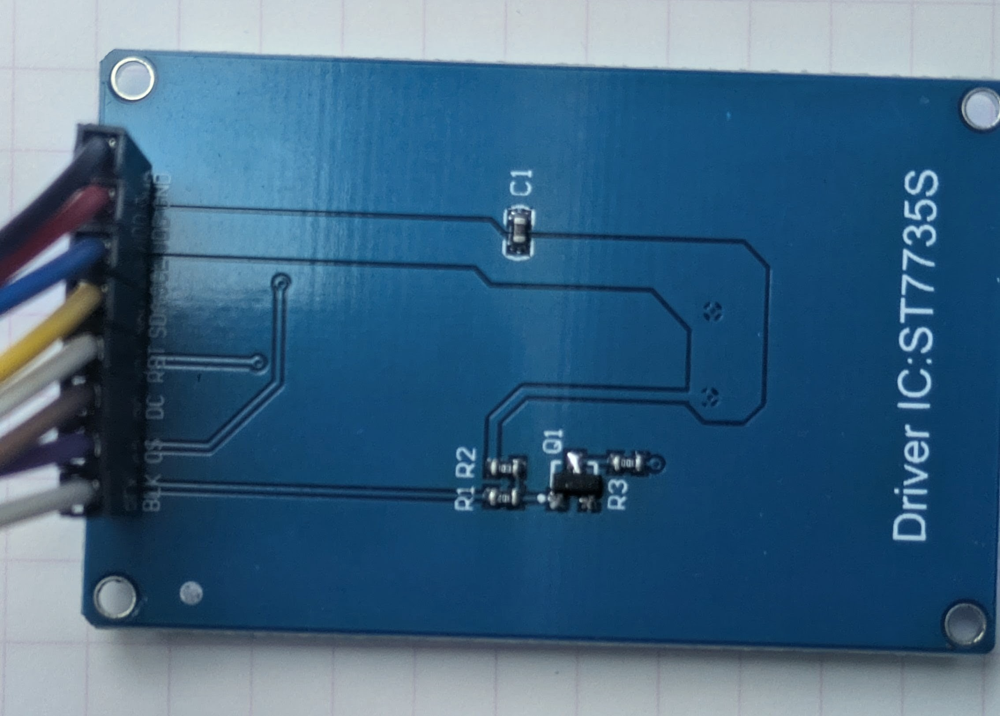
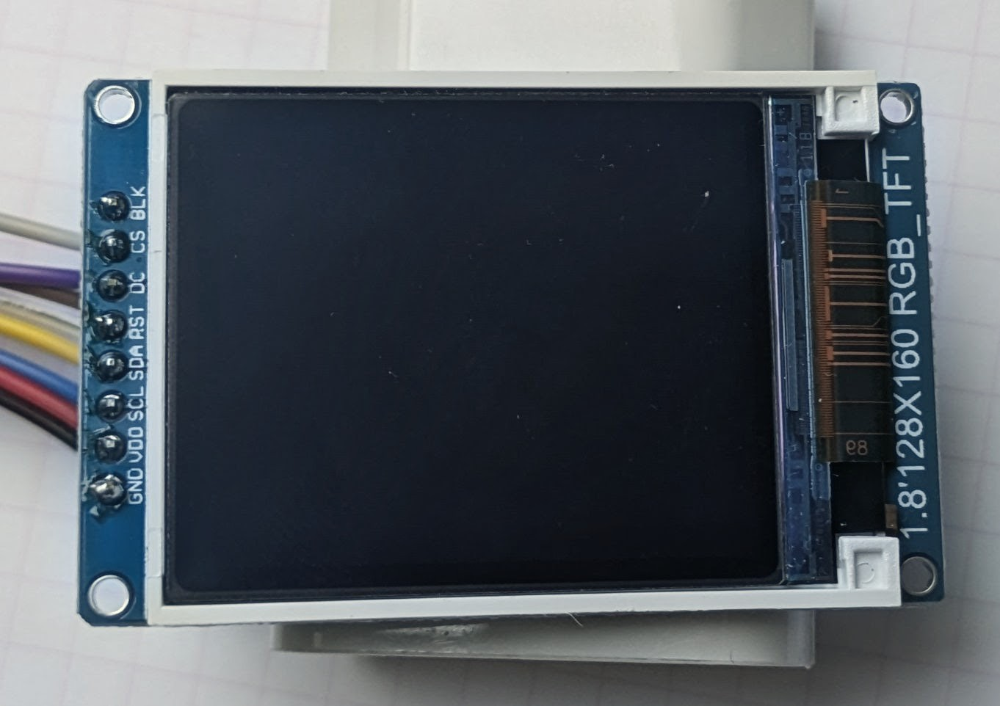

# ST7735 TFT Display Driver

A lightweight C++ driver for the Sitronix ST7735 TFT LCD display controller. Provides graphics primitives, text rendering, and full display control for embedded systems using AVR microcontrollers.

| Back                        | Front                        |
|-----------------------------|------------------------------|
|  |  |

## Features

- **128×160 pixel resolution** with 16-bit RGB565 color support (65,536 colors)
- **Graphics primitives**: lines, circles, rectangles, triangles, and bitmaps
- **Text rendering** with scalable fonts (1× to 8× magnification)
- **Display control**: on/off, sleep mode, color inversion
- **Rotation support**: 0°, 90°, 180°, 270° display orientations
- **Hardware SPI interface** for fast communication
- **Low power modes**: sleep mode reduces power consumption
- **Tearing signal support** for flicker-free animations

## Specifications

| Parameter             | Value                                 |
|-----------------------|---------------------------------------|
| Display Resolution    | 128 × 160 pixels                      |
| Color Depth           | 16-bit RGB565 (65,536 colors)         |
| Pixel Size            | ~0.6 mm (typical)                     |
| Interface             | SPI (Serial Peripheral Interface)     |
| Supply Voltage        | 3.3V (typical)                        |
| Operating Current     | 40–80 mA (display on), 200 µA (sleep) |
| Operating Temperature | -20°C to +70°C                        |
| Typical Refresh Rate  | 60 Hz                                 |

## Hardware Connections

### Pin Configuration

The ST7735 module typically has these pins:

| Pin   | Name         | Description                                 |
|-------|--------------|---------------------------------------------|
| GND   | Ground       | Power ground                                |
| VCC   | Power        | 3.3V power supply                           |
| SCL   | SPI Clock    | Connected to MCU SPI clock (MOSI on ATmega) |
| SDA   | SPI Data     | Connected to MCU SPI data (MISO on ATmega)  |
| A0/DC | Data/Command | Selects command vs. data mode (GPIO)        |
| CS    | Chip Select  | SPI chip select (optional, can tie to GND)  |
| RST   | Reset        | Hardware reset (optional GPIO)              |

### Typical Wiring Diagram (AVR ATmega328P)

```text
ST7735 Module          ATmega328P
─────────────          ──────────
GND ──────────────────► GND
VCC ──────────────────► 5V (through 3.3V regulator)
SCL (SCLK) ───────────► PB5 (SPI Clock)
SDA (MOSI) ───────────► PB3 (SPI MOSI)
A0/DC ─────────────────► PB0 (GPIO - Data/Command)
RST ────────────────────► PB1 (GPIO - Reset, optional)
CS ───────────────────► GND (or PB2 via SPIManager)
```

### Connection Notes

- **3.3V Supply**: ST7735 operates at 3.3V. Use a voltage regulator to step down from 5V.
- **Level Shifting**: If driving 5V GPIO to the display, use level shifters (e.g., 1kΩ series resistors with pullups to 3.3V).
- **Chip Select**: Can be tied directly to GND if using SPI exclusively for the display.
- **Reset Pin**: Optional; can disable by passing `-1` to constructor if not used.

## Installation

### 1. Add to Project

Copy the driver files to your project:

```bash
cp tft/src/ST7735.h <your_project>/include/
```

Ensure SPIManager and gpio.h are available in your include paths.

### 2. Include Header

```cpp
#include "ST7735.h"
```

## API Reference

### Constructor

```cpp
TFT_ST7735 display(int8_t dc, int8_t rst, SPIManager* spi);
```

**Parameters:**

- `dc`: Data/Command pin number (0-7 on PORTB)
- `rst`: Reset pin number (0-7 on PORTB, or -1 to disable)
- `spi`: Pointer to initialized SPIManager instance

**Example:**

```cpp
SPIManager spi;
TFT_ST7735 display(0, 1, &spi);  // DC on PB0, RST on PB1
```

### Initialization & Control

#### `void init()`

Initializes the display with default configuration. Performs hardware reset, sends initialization sequence, and enables display output.

**Example:**

```cpp
display.init();
```

#### `void setRotation(uint8_t m)`

Sets the display rotation.

**Parameters:**

- `m`: Rotation mode
  - `0`: Portrait (0°, default)
  - `1`: Landscape (90° clockwise)
  - `2`: Portrait upside-down (180°)
  - `3`: Landscape (270° clockwise)

**Example:**

```cpp
display.setRotation(0);   // Portrait
display.setRotation(1);   // Landscape
```

#### `void enableDisplay(uint8_t enable)`

Turns display on or off.

**Parameters:**

- `enable`: `0` = off, non-zero = on

**Example:**

```cpp
display.enableDisplay(1);   // Display on
display.enableDisplay(0);   // Display off
```

#### `void enableSleep(uint8_t enable)`

Enters or exits low-power sleep mode.

**Parameters:**

- `enable`: `0` = sleep out (wake), non-zero = sleep in

**Example:**

```cpp
display.enableSleep(1);   // Enter sleep (~200 µA)
delay(5000);              // Power save
display.enableSleep(0);   // Wake up (~10-100 ms)
```

#### `void enableTearing(uint8_t enable)`

Enables/disables tearing effect signal (vsync).

**Parameters:**

- `enable`: `0` = off, non-zero = on

**Example:**

```cpp
display.enableTearing(1);  // Sync with display refresh
```

#### `void invertDisplay(bool i)`

Inverts all display colors (black ↔ white).

**Parameters:**

- `i`: `true` = invert, `false` = normal

**Example:**

```cpp
display.invertDisplay(true);   // Inverted colors
display.invertDisplay(false);  // Normal colors
```

### Graphics Primitives

#### `void fillRect(uint8_t x, uint8_t y, uint8_t w, uint8_t h, uint16_t color)`

Fills a rectangular area with a solid color.

**Parameters:**

- `x, y`: Top-left corner coordinates
- `w, h`: Width and height in pixels
- `color`: RGB565 color value

**Example:**

```cpp
display.fillRect(0, 0, 128, 160, ST7735_BLUE);  // Fill entire screen
display.fillRect(10, 10, 50, 50, ST7735_RED);   // Fill square
```

#### `void drawPixel(uint8_t x, uint8_t y, uint16_t color)`

Sets a single pixel color.

**Example:**

```cpp
display.drawPixel(64, 80, ST7735_WHITE);
```

#### `void drawLine(uint8_t x0, uint8_t y0, uint8_t x1, uint8_t y1, uint16_t color)`

Draws a line between two points.

**Example:**

```cpp
display.drawLine(0, 0, 127, 159, ST7735_GREEN);  // Diagonal line
```

#### `void drawCircle(uint8_t x0, uint8_t y0, uint8_t r, uint16_t color)`

Draws a circle outline.

**Parameters:**

- `x0, y0`: Center coordinates
- `r`: Radius in pixels
- `color`: RGB565 color

**Example:**

```cpp
display.drawCircle(64, 80, 30, ST7735_YELLOW);
```

#### `void fillCircle(uint8_t x0, uint8_t y0, uint8_t r, uint16_t color)`

Draws a filled circle.

**Example:**

```cpp
display.fillCircle(64, 80, 30, ST7735_CYAN);
```

#### `void drawRoundRect(uint8_t x0, uint8_t y0, uint8_t w, uint8_t h, uint8_t radius, uint16_t color)`

Draws a rectangle with rounded corners (outline).

**Example:**

```cpp
display.drawRoundRect(20, 20, 88, 120, 10, ST7735_MAGENTA);
```

#### `void fillRoundRect(uint8_t x0, uint8_t y0, uint8_t w, uint8_t h, uint8_t radius, uint16_t color)`

Draws a filled rectangle with rounded corners.

**Example:**

```cpp
display.fillRoundRect(20, 20, 88, 120, 10, ST7735_GREEN);
```

#### `void drawTriangle(uint8_t x0, uint8_t y0, uint8_t x1, uint8_t y1, uint8_t x2, uint8_t y2, uint16_t color)`

Draws a triangle outline.

**Example:**

```cpp
display.drawTriangle(10, 10, 50, 50, 30, 100, ST7735_RED);
```

#### `void fillTriangle(uint8_t x0, uint8_t y0, uint8_t x1, uint8_t y1, uint8_t x2, uint8_t y2, uint16_t color)`

Draws a filled triangle.

**Example:**

```cpp
display.fillTriangle(10, 10, 50, 50, 30, 100, ST7735_ORANGE);
```

#### `void drawRGBBitmap(uint8_t x, uint8_t y, uint16_t* pcolors, uint8_t w, uint8_t h)`

Draws raw RGB565 bitmap data.

**Parameters:**

- `x, y`: Starting coordinates
- `pcolors`: Pointer to RGB565 pixel array (w × h elements)
- `w, h`: Bitmap dimensions

**Example:**

```cpp
uint16_t bitmap[32*32];  // 32×32 image
// ... populate bitmap ...
display.drawRGBBitmap(48, 64, bitmap, 32, 32);
```

### Text Rendering

#### `void drawChar(uint8_t x, uint8_t y, unsigned char c, uint16_t color, uint16_t bg, uint8_t size)`

Draws a single ASCII character.

**Parameters:**

- `x, y`: Character position (top-left)
- `c`: ASCII character code
- `color`: Text color (RGB565)
- `bg`: Background color (RGB565)
- `size`: Magnification (1 = normal, 2 = 2×, etc.)

**Example:**

```cpp
display.drawChar(0, 0, 'A', ST7735_WHITE, ST7735_BLACK, 1);
display.drawChar(10, 10, 'B', ST7735_GREEN, ST7735_BLUE, 2);
```

#### `void drawText(uint8_t x, uint8_t y, const char* txt, uint16_t color, uint16_t bg, uint8_t size)`

Draws a null-terminated text string.

**Parameters:**

- `x, y`: String position (top-left)
- `txt`: Pointer to string
- `color`: Text color
- `bg`: Background color
- `size`: Magnification

**Example:**

```cpp
display.drawText(20, 75, "ST7735", ST7735_WHITE, ST7735_BLUE, 1);
display.drawText(10, 10, "Hello!", ST7735_YELLOW, ST7735_BLACK, 2);
```

#### `void drawChar(..., uint8_t size_x, uint8_t size_y)`

#### `void drawText(..., uint8_t size_x, uint8_t size_y)`

Versions with separate X and Y magnification.

**Example:**

```cpp
display.drawText(10, 10, "Wide", ST7735_WHITE, ST7735_BLACK, 3, 1);
```

### Color Management

#### `uint16_t color565(uint8_t r, uint8_t g, uint8_t b)`

Converts 8-bit RGB to 16-bit RGB565 color format.

**Parameters:**

- `r, g, b`: 8-bit color components (0-255)

**Returns:** 16-bit RGB565 value

**Example:**

```cpp
uint16_t orange = display.color565(255, 165, 0);
uint16_t purple = display.color565(128, 0, 128);
display.fillRect(0, 0, 64, 80, orange);
```

### Predefined Colors

```cpp
ST7735_BLACK      // Black
ST7735_WHITE      // White
ST7735_RED        // Red
ST7735_GREEN      // Green
ST7735_BLUE       // Blue
ST7735_CYAN       // Cyan
ST7735_MAGENTA    // Magenta
ST7735_YELLOW     // Yellow
ST7735_ORANGE     // Orange
```

### Advanced Methods

#### `void startWrite(void)` / `void endWrite(void)`

Manual SPI transaction control. Useful when coordinating multiple devices on the same SPI bus.

**Example:**

```cpp
display.startWrite();
display.fillRect(0, 0, 64, 80, ST7735_RED);
display.fillRect(64, 0, 64, 80, ST7735_BLUE);
display.endWrite();
```

#### `uint32_t readPixel(uint8_t x, uint8_t y)`

Reads the color value of a pixel. Display must support read mode.

**Example:**

```cpp
uint32_t pixel = display.readPixel(64, 80);
```

#### `uint32_t readcommand32(uint8_t c)`

Reads a 32-bit response from a display command (e.g., manufacturer ID).

**Example:**

```cpp
uint32_t id = display.readcommand32(ST7735_RDDID);
```

## Usage Examples

### Basic Initialization & Drawing

```cpp
#include "ST7735.h"
#include "gpio.h"

// Setup SPI and display
SPIManager spi;
TFT_ST7735 display(0, 1, &spi);  // DC=PB0, RST=PB1

void setup() {
    GPIO_OUTPUT(B, 0);  // DC pin
    GPIO_OUTPUT(B, 1);  // RST pin
    display.init();
    display.setRotation(0);
}

void loop() {
    // Fill display with blue
    display.fillRect(0, 0, 128, 160, ST7735_BLUE);
    
    // Draw white circle
    display.fillCircle(64, 80, 30, ST7735_WHITE);
    
    // Draw text
    display.drawText(20, 75, "ST7735!", ST7735_YELLOW, ST7735_BLUE);
    
    delay(2000);
    
    // Clear display
    display.fillRect(0, 0, 128, 160, ST7735_BLACK);
}
```

### Drawing Shapes

```cpp
void draw_shapes() {
    // Clear screen
    display.fillRect(0, 0, 128, 160, ST7735_BLACK);
    
    // Draw rectangle
    display.fillRect(10, 10, 50, 50, ST7735_RED);
    
    // Draw circle
    display.fillCircle(100, 30, 20, ST7735_GREEN);
    
    // Draw triangle
    display.fillTriangle(10, 120, 50, 80, 50, 160, ST7735_BLUE);
    
    // Draw line
    display.drawLine(60, 80, 120, 160, ST7735_WHITE);
    
    // Draw rounded rectangle
    display.fillRoundRect(70, 120, 50, 30, 5, ST7735_YELLOW);
}
```

### Text Display with Scaling

```cpp
void draw_text_demo() {
    display.fillRect(0, 0, 128, 160, ST7735_BLACK);
    
    // Size 1 (normal)
    display.drawText(5, 5, "Size 1", ST7735_WHITE, ST7735_BLACK, 1);
    
    // Size 2 (2× magnification)
    display.drawText(5, 30, "Size 2", ST7735_GREEN, ST7735_BLACK, 2);
    
    // Size 3 (3× magnification)
    display.drawText(5, 80, "Size 3", ST7735_RED, ST7735_BLACK, 3);
    
    // Custom colors
    uint16_t orange = display.color565(255, 165, 0);
    display.drawText(5, 130, "Orange", orange, ST7735_BLACK, 1);
}
```

### Animation with Rotation

```cpp
void animation_demo() {
    for (uint8_t rot = 0; rot < 4; rot++) {
        display.setRotation(rot);
        display.fillRect(0, 0, 128, 160, ST7735_BLACK);
        display.fillCircle(64, 80, 30, ST7735_CYAN);
        display.drawText(25, 75, "Rotated", ST7735_WHITE, ST7735_BLACK);
        delay(1000);
    }
}
```

### Gauge/Progress Display

```cpp
void draw_progress_bar(uint8_t percent) {
    if (percent > 100) percent = 100;
    
    // Background
    display.fillRect(20, 70, 88, 20, ST7735_BLACK);
    display.drawRoundRect(20, 70, 88, 20, 5, ST7735_WHITE);
    
    // Progress bar
    uint8_t width = (88 * percent) / 100;
    display.fillRect(22, 72, width - 4, 16, ST7735_GREEN);
    
    // Percentage text
    char buf[10];
    snprintf(buf, sizeof(buf), "%d%%", percent);
    display.drawText(50, 50, buf, ST7735_WHITE, ST7735_BLACK, 2);
}
```

### Low-Power Sleep Mode

```cpp
void sleep_demo() {
    display.init();
    display.fillRect(0, 0, 128, 160, ST7735_BLUE);
    display.drawText(20, 75, "Sleep", ST7735_WHITE, ST7735_BLUE);
    
    delay(3000);
    
    display.enableSleep(1);  // Sleep (~200 µA)
    delay(5000);
    
    display.enableSleep(0);  // Wake up
    delay(100);
    
    display.fillRect(0, 0, 128, 160, ST7735_GREEN);
    display.drawText(20, 75, "Awake!", ST7735_WHITE, ST7735_GREEN);
}
```

## Configuration & Tuning

### Display Initialization

The display initializes with default parameters:

- Orientation: Portrait (0°)
- Color mode: RGB565 (16-bit)
- Frame rate: 60 Hz (typical)
- Display ON, sleep OFF

Modify these by calling `setRotation()` and control methods after `init()`.

### SPI Speed

The SPI speed is controlled by SPIManager. Typical configurations:

| Speed  | Description                      |
|--------|----------------------------------|
| ~1 MHz | Safe, reliable on long wires     |
| ~4 MHz | Typical for on-board connections |
| ~8 MHz | Fast; requires short SPI wires   |

### Power Consumption

| Mode        | Typical Current |
|-------------|-----------------|
| Display ON  | 40–80 mA        |
| Sleep mode  | ~200 µA         |
| Display OFF | ~50 mA          |

Use `enableSleep()` for battery-powered applications.

## Troubleshooting

### Display Not Showing Anything

**Problem:** No output after calling `init()`

**Solutions:**

1. Verify 3.3V power supply to the module
2. Check SPI connections (SCL, SDA/MOSI)
3. Check DC pin connection
4. Try `enableDisplay(1)` to turn on display
5. Verify SPIManager is properly initialized

### Distorted or Inverted Colors

**Problem:** Colors appear wrong

**Solutions:**

1. Try `invertDisplay(true)` to invert colors
2. Check if `setRotation()` is correct
3. Verify RGB565 color values are in range [0x0000, 0xFFFF]
4. Use `color565()` helper to generate colors from 8-bit RGB

### Display Flickers During Drawing

**Problem:** Visible flicker/tearing during animations

**Solutions:**

1. Enable tearing signal: `enableTearing(1)`
2. Use `startWrite()` and `endWrite()` to batch operations
3. Reduce SPI speed if instability occurs
4. Add 100nF capacitor near display power pins

### Text Appears Garbled

**Problem:** Characters not displayed correctly

**Solutions:**

1. Verify string is null-terminated
2. Check text size parameter (try size 1)
3. Ensure x, y coordinates are within bounds (0-127, 0-159)
4. Verify font data (if using custom fonts)

### Display Doesn't Wake from Sleep

**Problem:** `enableSleep(0)` doesn't wake display

**Solutions:**

1. Add delay after `enableSleep(0)`: `delay(100)`
2. Call `enableDisplay(1)` after waking
3. Re-initialize with `init()` if needed

### SPI Communication Errors

**Problem:** Intermittent glitches or no communication

**Solutions:**

1. Check SPI bus for other devices (use CS pin properly)
2. Add decoupling capacitors (100nF) near power pins
3. Shorten SPI wires or reduce speed
4. Check for GPIO pin conflicts with SPI pins
5. Verify SPIManager initialization before display usage

## Performance Characteristics

| Operation                  | Time (typical) |
|----------------------------|----------------|
| Full screen fill (128×160) | ~15 ms @ 4 MHz |
| Draw circle (r=30)         | ~5 ms          |
| Draw text (16 chars)       | ~10 ms         |
| Init/reset                 | ~100 ms        |
| Sleep mode exit            | 10–100 ms      |

Times vary with SPI speed and content complexity.

## References

- **ST7735 Datasheet**: [Sitronix ST7735 Specification](./ST7735S.pdf)
- **SPIManager Documentation**: See `spi/` directory
- **GPIO Library**: See `avrtools/src/gpio.h`

## See Also

- [SPI Manager Driver](../spi/README.md)
- [I2C Master Driver](../i2c/readme.md)
- [GPIO Library](../avrtools/readme.md)
